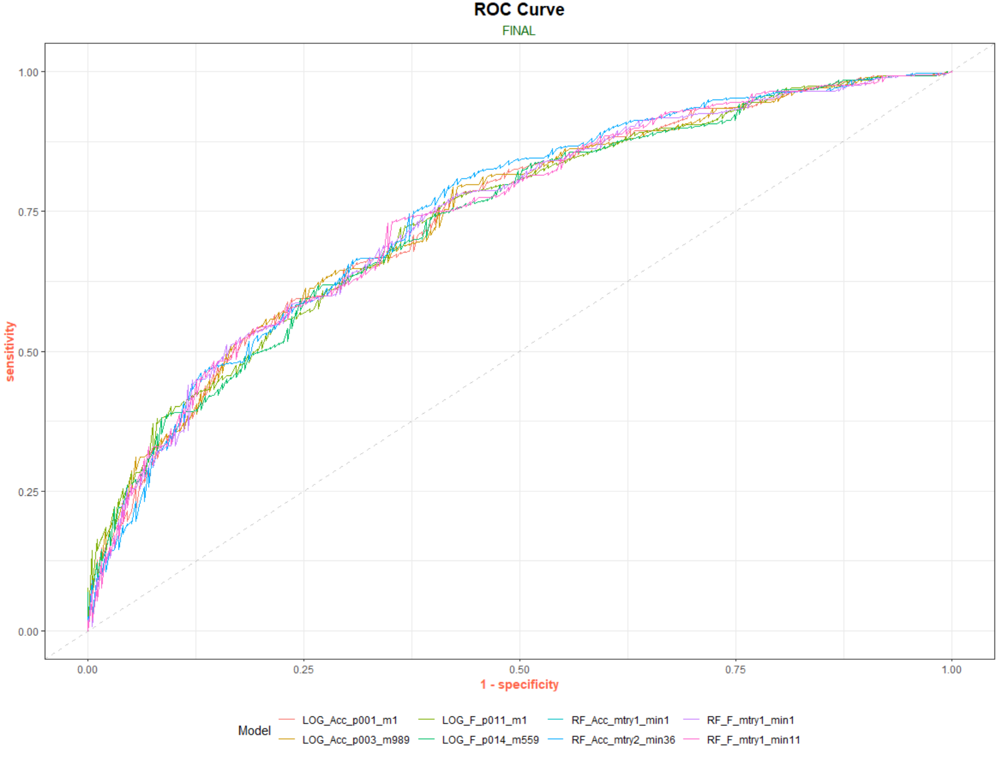

### Table of Contents

---
# Project Overview

## Summary

### Code Used

Package | version
--- | ---
tidymodels | 0.1.2
stringr | 1.4.0
forcats | 0.5.0
RColorBrewer | 1.1-2
ggmosaic | 0.3.4
ggpubr | 0.4.0
FactoMiner | 2.4
factoextra | 1.0.7
probably | 0.0.6
workflowsets | 0.0.1
doParallel | 1.0.16

### Business Requirement
1. Develop a Model to predict if a player will be drafted
2. For the players that got drafted develop a Model to predict if they will be drafted in the 1st Round.

### Data Collection
**(raw)**

Feature | Datatype | Description
--- | --- | ---
player | chr | name of the player
position | chr | position player played in college
school | chr | where player played in college
year | dbl | year player entered the draft
height | dbl | height of player _(cm)_
weight | dbl | weight of player _(lbs)_
forty | dbl | how fast player runs 40yards _(seconds)_
vertical | dbl | how high player jumps from a still position _(inches)_
bench | dbl | how many times player can lift 225lbs
broad_jump | dbl | how far can a player jump. From a balanced stance, the player explodes forward as far as he can and must land without moving _(inches)_
three_cone | dbl | primarily run to evaluate the agility, quickness and fluidity of movement _(seconds)_
shuttle | dbl | The shuttle (20yards), much like the 3-cone drill, test speed and acceleration. The only difference is that players are running laterally instead of forming a right angle.  _(seconds)_
drafted | chr | What NFL team drafted player / Round / Pick / Year

---

# Exploratory Data Analysis

## Summary

**Note (Target)**: **_65%_** of players in this dataset was Drafted

**Note (Position)**: There are _1459_ Defensive and _1426_ Offensive players in this dataset
- Of the _1459_ Defensive players **70%** was Drafted. Of the _1426_ Offensive players **61%** was Drafted.
- Top 3 Offensive Positions Drafted: **_OT | WR | RB_**
- Top 3 Defensive Positions Drafted: **_CB | DE | OLB_**

**Note (Conference)**: The majority of players Drafted came from the **_[ SEC | ACC | Big 10 ]_** Conferences

## Correlation

**Note (Correlation)**: Alot of the Combine metrics are **_Highly_** Corelated

## Principal Component Analysis

  
  

**Note (PCA)**:
- **PC1**: Represents Agility/Explosiveness
  + Agility: forty | three_cone | shuttle
    + generally if your fast in one your fast in the others
  + Explosiveness: vertical | broad_jump
    + generally if you can jump well vertically you can jump well horizontally
- **PC2**: Represents overall strength

## Combine Summary

### Weight

**Note (Weight)**: Average weight for players in this dataset is **_252lbs_**
- Offense: **_262lbs_**
  + Average weight for **OT** is **_315lbs_** for both drafted and non drafted players
  + Average weight for **WR** is **_204lbs_** for both drafted and non drafted players
  + Average weight for **RB** is **_215lbs_** for both drafted and non drafted players
- Defense: **_242lbs_**
  + Average weight for **CB** is **_193lbs_** for both drafted and non drafted players
  + Average weight for **DE** is **_268lbs_** for both drafted and non drafted players
  + Average weight for **OLB** is around **_240lbs_** for both drafted and non drafted players
- Conference: Averages
  + Elite = **_253lbs_** | Division I-A = **_246lbs_** | Division I-AA = **_252_** | Division II & II = **_266lbs_**

### Forty

**Note (Forty):** Average forty for players in this dataset is **_4.81secs_**
- Offense: **_4.72secs_**
  + Average forty for **OT**: Drafted = **_5.21_** | Not Drafted = **_5.34_**
  + Average forty for **WR**: Drafted = **_4.47_** | Not Drafted = **_4.55_**
  + Average forty for **RB**: Drafted = **_4.52_** | Not Drafted = **_4.61_**
- Defense: **_4.90secs_**
  + Average forty for **CB**: Drafted = **_4.47_** | Not Drafted = **_4.54_**
  + Average forty for **DE**: Drafted = **_4.80_** | Not Drafted = **_4.89_**
  + Average forty for **OLB**: Drafted = **_4.65_** | Not Drafted = **_4.74_**
- Conference: Averages
  + Elite = **_4.81secs_** | Division I-A = **_4.78secs_** | Division I-AA = **_4.82secs_** | Division II & II = **_4.89secs_**

### Bench

**Note (Bench):** Average bench for players in this dataset is **_21reps_**
- Offense: **_21reps_**
  + Average bench for **OT**: Drafted = **_25reps_** | Not Drafted = **_23reps_**
  + Average bench for **WR** was **_14reps_** for both drafted and non drafted players
  + Average bench for **RB**: Drafted = **_20reps_** | Not Drafted = **_19reps_**
- Defense: **_21reps_**
  + Average bench for **CB**: Drafted = **_15reps_** | Not Drafted = **_13reps_**
  + Average bench for **DE**: Drafted = **_24reps_** | Not Drafted = **_23reps_**
  + Average bench for **OLB**: Drafted = **_23reps_** | Not Drafted = **_21reps_**
- Conference: Averages
  + Elite = **_21reps_** | Division I-A = **_21reps_** | Division I-AA = **_21reps_** | Division II & II = **_23reps_**

### Broad Jump

**Note (Jump):** Average broad jump for players in this dataset is **_113inches**
- Offense: **_110inches_**
  + Average broad jump for **OT**: Drafted = **_103inches_** | Not Drafted = **_100inches_**
  + Average broad jump for **WR**: Drafted = **_121inches_** | Not Drafted = **_119inches_**
  + Average broad jump for **RB**: Drafted = **_119inches_** | Not Drafted = **_117inches_**
- Defense: **_116inches_**
  + Average broad jump for **CB**: Drafted = **_122inches_** | Not Drafted = **_120inches_**
  + Average broad jump for **DE**: Drafted = **_115inches_** | Not Drafted = **_113inches_**
  + Average broad jump for **OLB**: Drafted = **_118inches_** | Not Drafted = **_115inches_**
- Conference: Averages
  + Elite = **_113inches_** | Division I-A = **_114inches_** | Division I-AA = **_113inches_** | Division II & II = **_112inches_**

---

# Modeling

## Preprocess

**Split**

- **Train**: 80% stratified by drafted feature
- **Test**: 20% stratified by drafted feature
- **Validation**: 10 fold cross-validation using the training set

## Preprocess - Logistic Regression

#### NORMAL
- **Bin**: Infrequent position into "Other" category   
- **Normalize**: All numeric variables
- **Dummy**: All categorical variables

**Model Data**

#### PCA
**Eigen**

**Components**

**Model Data**

### Simple
**Model Data**  

## Preprocess - Random Forrest

#### NORMAL

**Model Data**

#### PCA
**Model Data**

#### Simple
**Model Data**

### Control
- **Parallel Processing**

### Metrics
 - **AUC:** Measure of performance across all possible class
 - **Accuracy:** What percentage did the model correctly predicted who got drafted and who didn't
 - **Sensitivity:** Out of all the players that got actually got drafted what percentage did the model predict correctly
 - **Specificity:** Out of all the players that got did not get drafted what percentage did the model predict correctly
 - **Precision:** Out of all the players the Model predicted got Drafted what percentage actually got Drafted ?
 - **F1:** Balance between Precision and Recall "Sensitivity"

## Fit

### Logistic Regression

**Grid**

#### **Accuracy**

Preprocess | Grid | Penalty | Mixture | Stat
--- | --- | --- | --- | ---
Normal | Latin | 0.003 | 0.989 | 71.3%
PCA  | Latin | 0.000 | 0.101 | 68.8%
Simple | Latin | 0.000 | 0.925 | 70.3%
Normal | Custom | 0.001 | 1 | 71.4%
PCA  | Custom | 0.016 | 1 | 69.4%
Simple | Custom | 0.016 | 0.5 | 69.8%

#### **F Score**

Preprocess | Grid | Penalty | Mixture | Stat
--- | --- | --- | --- | ---
Normal | Latin | 0.011 | 0.559 | 80.4%
PCA  | Latin | 0.086 | 0.204 | 79.6%
Simple | Latin | 0.014 | 0.559 | 79.7%
Normal | Custom | 0.011 | 1 | 80.6%
PCA  | Custom | 0.026 | 0.5 | 79.9%
Simple | Custom | 0.011 | 1 | 80%

### Random Forest

**Grid**

#### **Accuracy**

Preprocess | grid | mtry | min_n | Stat
--- | --- | --- | --- | ---
None | Latin | 4 | 6 | 70.3%
PCA  | Latin | 1 | 11 | 68.5%
Simple | Latin | 2 | 36 | 70.4%
None | Custom | 3 | 9 | 69.8%
PCA  | Custom | 1 | 7 | 68.4%
Simple | Custom | 1 | 1 | 70.3%

#### **F Score**

Preprocess | grid | mtry | min_n | Stat
--- | --- | --- | --- | ---
None | Latin | 1 | 40 | 79.8%
PCA  | Latin | 1 | 34 | 79.4%
Simple | Latin | 1 | 11 | 79.8%
None | Custom | 1 | 3 | 79.5%
PCA  | Custom | 1 | 7 | 79.3%
Simple | Custom | 1 | 1 | 80%

---

# Validation Diagnostic

## Logistic Regression

### Confusion Matrix

### ROC Curve

### Metrics
Optimization | AUC | Accuracy | Sensitivity | Specificity | Precision | Recall | F1
--- | --- | --- | --- | --- | --- | --- | ---
Accuracy (P = 0.003, M = 0.989) | 0.711 | 0.707 | 0.86 | 0.415 | 0.736 | 0.86 | 0.793
Accuracy (P = 0.001, M = 1) | 0.713 | 0.704 | 0.85 | 0.428 | 0.738 | 0.85 | 0.79
F Score (P = 0.014, M = 0.559) | 0.718 | 0.709 | 0.917 | 0.314 | 0.717 | 0.917 | 0.805
F Score (P = 0.011, M = 1) | 0.712 | 0.704 | 0.92 | 0.296 | 0.712 | 0.92 | 0.803

## Random Forrest

### Confusion Matrix

### ROC Curve

### Metrics

Optimization | AUC | Accuracy | Sensitivity | Specificity | Precision | Recall | F1
--- | --- | --- | --- | --- | --- | --- | ---
Accuracy (mtry = 2, min = 36) | 0.735 | 0.711 | 0.907 | 0.34 | 0.722 | 0.907 | 0.804
Accuracy (mtry = 1, min = 1) | 0.726 | 0.693 | 0.917 | 0.27 | 0.704 | 0.917 | 0.797
F Score (mtry = 1, min = 1) | 0.726 | 0.693 | 0.917 | 0.27 | 0.704 | 0.917 | 0.797
F Score (mtry = 1, min = 11) | 0.731 | 0.696 | 0.917 | 0.277 | 0.706 | 0.917 | 0.798

---
# Refit: Probability Threshold

## Logistic Regression

### Metrics
Optimization | AUC | Accuracy | Sensitivity | Specificity | Precision | Recall| F1
--- | --- | --- | --- | --- | --- | --- | ---
Acc-70%, (P = 0.003, M = 0.989) | 0.711 | 0.622 | 0.548 | 0.761 | 0.813 | 0.548 | 0.655
Acc-60%, (P = 0.001, M = 1) | 0.713 | 0.678 | 0.741 | 0.56 | 0.761 | 0.741 | 0.751

## Random Forrest

### Metrics
Optimization | AUC | Accuracy | Sensitivity | Specificity | Precision | Recall | F1
--- | --- | --- | --- | --- | --- | --- | ---
Acc-70%  (mtry = 2, min = 36)| 0.735 | 0.607 | 0.475 | 0.855 | 0.861 | 0.475 | 0.612
Acc-65%  (mtry = 1, min = 1)| 0.726 | 0.687 | 0.767 | 0.535 | 0.757 | 0.767 | 0.762 

---
# Final Diagnostic

## Confusion Matrix
**Logistic Regression**

**Random Forrest**

## ROC Curve

## Metrics  

Optimization | AUC | Accuracy | Sensitivity | Specificity | Precision | F1
--- | --- | --- | --- | --- | --- | ---
Logistic Regression (Thres 50%) | 0.749 | 0.708 | 0.889 | 0.367 | 0.727 | 0.80
Logistic Regression (Thres 60%) | 0.749 | 0.694 | 0.769 | 0.553 | 0.765 | 0.767  
Logistic Regression F | 0.732 | 0.689 | 0.958 | 0.181 | 0.689 | 0.801
Random Forrest (Thres 50%) | 0.74 | 0.724 | 0.875 | 0.437 | 0.747 | 0.806  
Random Forrest (Thres 60%) | 0.74 | 0.693 | 0.721 | 0.638 | 0.791 | 0.755  
Random Forrest F | 0.738 | 0.694 | 0.947 | 0.216 | 0.696 | 0.802
