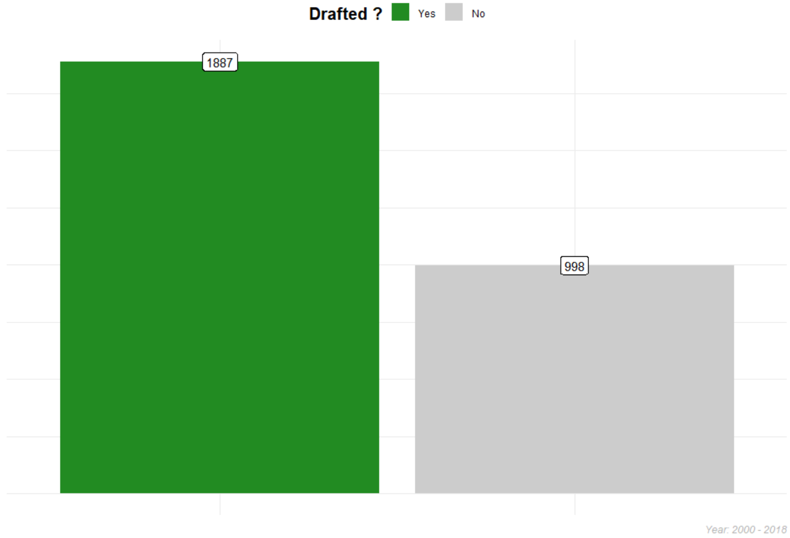
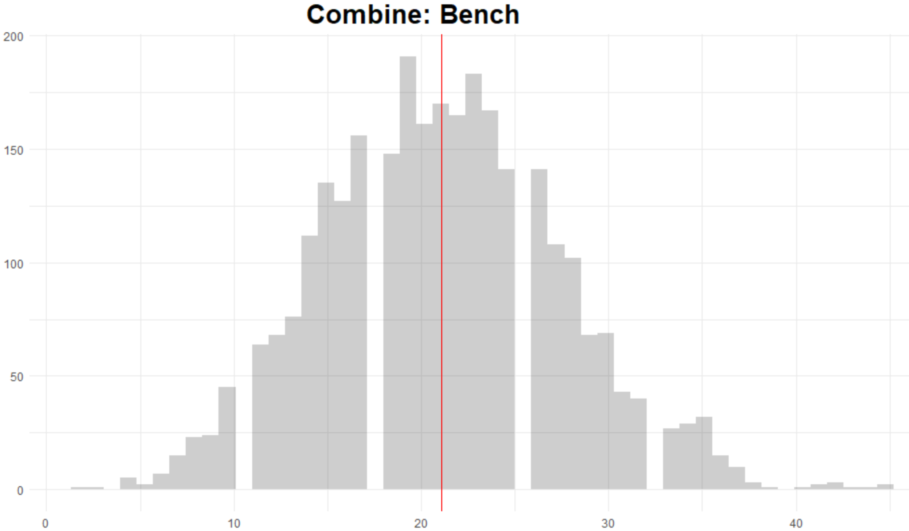
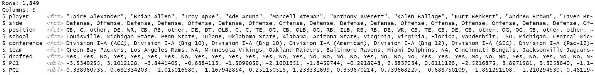
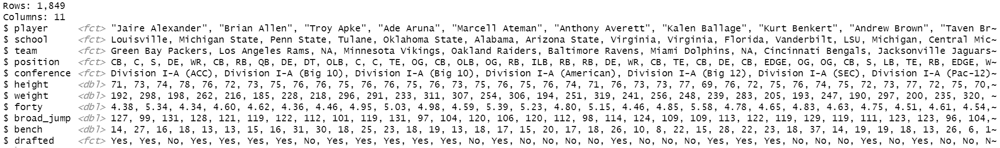
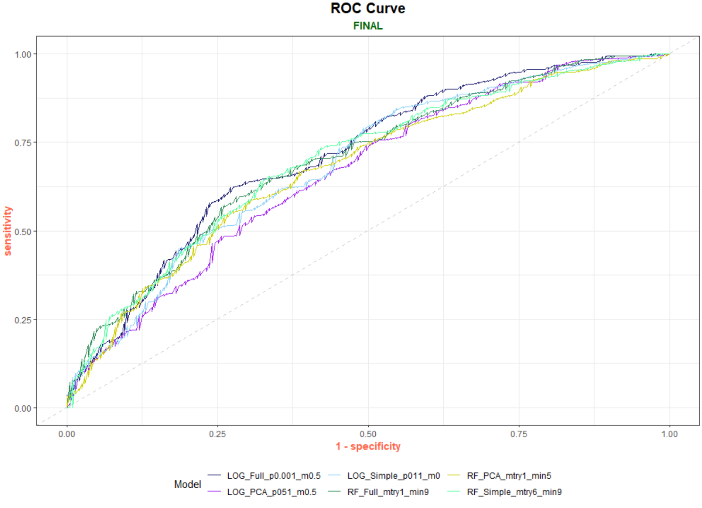
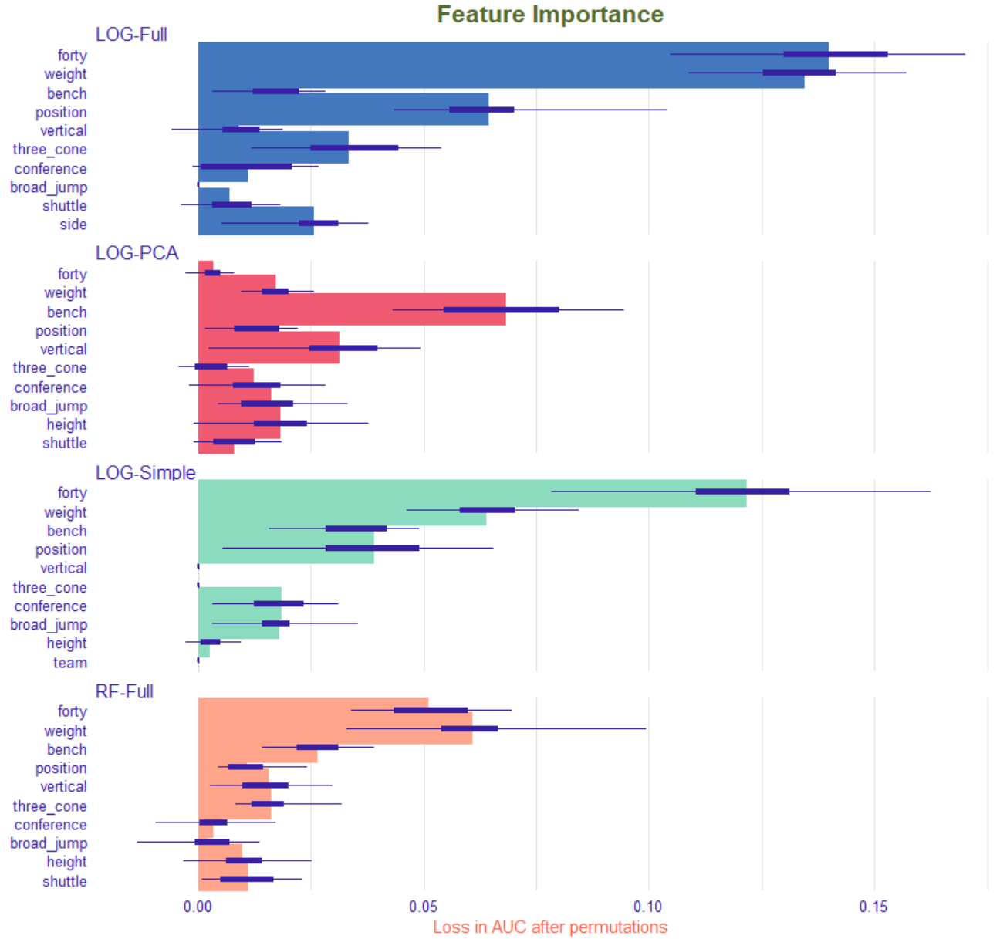
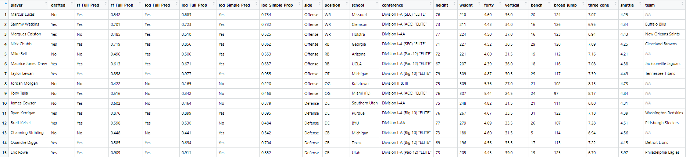

# Project Overview

### Table of Contents
- [Summary](https://github.com/Gmabatah93/PROJECT_NFL_Combine#summary)
- [Exploratory Data Analysis](https://github.com/Gmabatah93/PROJECT_NFL_Combine#exploratory-data-analysis)
- [Modeling](https://github.com/Gmabatah93/PROJECT_NFL_Combine#modeling)
- [Validation Results](https://github.com/Gmabatah93/PROJECT_NFL_Combine#validation-diagnostic)
- [Test Results](https://github.com/Gmabatah93/PROJECT_NFL_Combine#test-results)
- [Prescriptive Analysis](https://github.com/Gmabatah93/PROJECT_NFL_Combine#prescriptive-analysis)
- [Conclusion](https://github.com/Gmabatah93/PROJECT_NFL_Combine#conclusion)

---

### Code Used

Package | version
--- | ---
tidymodels | 0.1.2
stringr | 1.4.0
forcats | 0.5.0
RColorBrewer | 1.1-2
ggmosaic | 0.3.4
ggpubr | 0.4.0
FactoMiner | 2.4
factoextra | 1.0.7
probably | 0.0.6
workflowsets | 0.0.1
doParallel | 1.0.16

### Business Requirement
1. Develop a Model to predict if a player will be drafted
2. Examine the importance of combine results relate to being drafted.

### Data Collection
> This Dataset consist of players who entered the drafted between the year 2000 - 2018

**(raw)**

Feature | Datatype | Description
--- | --- | ---
player | chr | name of the player
position | chr | position player played in college
school | chr | where player played in college
year | dbl | year player entered the draft
height | dbl | height of player _(cm)_
weight | dbl | weight of player _(lbs)_
forty | dbl | how fast player runs 40yards _(seconds)_
vertical | dbl | how high player jumps from a still position _(inches)_
bench | dbl | how many times player can lift 225lbs
broad_jump | dbl | how far can a player jump. From a balanced stance, the player explodes forward as far as he can and must land without moving _(inches)_
three_cone | dbl | primarily run to evaluate the agility, quickness and fluidity of movement _(seconds)_
shuttle | dbl | The shuttle (20yards), much like the 3-cone drill, test speed and acceleration. The only difference is that players are running laterally instead of forming a right angle.  _(seconds)_
drafted | chr | What NFL team drafted player / Round / Pick / Year

**Feature Engineering**

Feature | Description
--- | ---
drafted | split the drafted variable to represent one feature for [Team / Round / Pick / Year] & changed the drafted variable to a factor ["Yes","No"] to represent weather a player was drafted or not.
side | created a new variable for High Level analysis of just offensive players and defensive players.
conference | created a variable to view conference by conference instead of school by school

## Summary
> **EDA Target (Drafted):** \
Of the 2,885 players in this dataset from 2000-2018 **_65%_** was drafted. \
Of the **_65%_** of players that were drafted, most of them came from the **_ELITE ("SEC", "ACC", "Big 10","Big 12", "Pac-12")_** conferences, the top 3 positions were:
> - Defense: **_[ CB | DE | OLB]_**
> - Offense: **_[ OT | WR | RB ]_**

> **PCA:** \
The combine statistics were HIGHLY correlated with each other. \
After performing PCA, it was shown that the first 2 principal components accounted for 80% of the variance in the data. Therefore there were two themes that summarized the data.
> 1. The 1st principal component was represented by **_[ Weight | Forty | Three_cone | shuttle | broad_jump | vertical ]_**. In my opinion, this can best be summarized as a players overall athleticism in regards to **_Agility and Explosiveness_**. Also after looking a the biplot, Forty, Three_cone, and shuttle pretty much represented the same thing so Forty time can essentially represent the 3. Broad_jump & vertical, can just be represented by broad_jump
> 2. The 2nd principal component was represented by **_Bench_**. This simply is the overall **_strength_** of a player.

> **Combine Data**: \
The average _WEIGHT_ for everyone in the dataset was **_252lbs_**. By _Position_: CB = **_193lbs_**, DE = **_268lbs_**, OLB = **_240lbs_**, OT = **_315lbs_**, WR = **_204lbs_**, RB = **_215lbs_**. By _Conference_: Elite = **_253lbs_**, Division I-A = **_246lbs_**, Division I-AA = **_252lbs_**, Divsion II & III = **_266lbs_** .\
The average _FORTY_ for everyone in the dataset was **_4.81secs_**. By _Position_: CB = **_4.49secs_**, DE = **_4.83secs_**, OLB = **_4.68secs_**, OT = **_5.25secs_**, WR = **_4.51secs_**, RB = **_4.56secs_**. By _Conference_ Elite = **_4.81sec_**, Division I-A = **_4.78secs_**, Division I-AA = **_4.82secs_**, Divsion II & III = **_4.89secs_**. \
The average _BENCH_ for everyone in the dataset was **_21reps_**. By _Position_: CB = **_14reps_**, DE = **_24reps_**, OLB = **_23reps_**, OT = **_24reps_**, WR = **_14reps_**, RB = **_20reps_**. By _Conference_: Elite = **_21reps_**, Division I-A = **_21reps_**, Division I-AA = **_21reps_**, Divsion II & III = **_23reps_**. \
The average _BROAD JUMP_ for everyone in the dataset was **_113inches_**. By _Position_: CB = **_122inches_**, DE = **_115inches_**, OLB = **_118inches_**, OT = **_102inches_**, WR = **_121inches_**, RB = **_118inches_**. By _Conference_: Elite = **_113inches_**, Division I-A = **_114inches_**, Division I-AA = **_113inches_**, Divsion II & III = **_112inches_**.

> **MODELING**: \
Metrics: AUC, Accuracy, Sensitivity, Specificity, **F1** ("Used to ultimately to select the best model"). \
The 1st model **Random Forrest** was fit trying three different dataset. 1) As is, meaning no preprocess. 2) using PCA with the first 2 principal components. 3) a simpler dataset removing the highly correlated features. \
The 2nd model **Logistic Regression** was fit trying three different dataset. 1) With minimal preprocessing ("normalized", "dummy"). 2) Minimal preprocessing and PCA using the first 2 principal components. 3) simpler dataset removing the highly correlated features and minimal preprocessing.

> **VALIDATION METRICS**

Model | AUC | Accuracy | Sensitivity | Specificity | Precision | Recall | F1
--- | --- | --- | --- | --- | --- | --- | ---
**_LOG (NORMAL: P = 0.001, M = 0.5)_** | **_0.737_** | **_0.72_** | **_0.907_** | **_0.365_** | **_0.73_** | **_0.907_** | **_0.809_**
LOG (SIMPLE: P = 0.011, M = 0) | 0.725 | 0.696 | 0.914 | 0.283 | 0.707 | 0.914 | 0.797
RF (SIMPLE: mtry = 6, min = 9) | 0.703 | 0.698 | 0.85 | 0.409 | 0.731 | 0.85 | 0.786
RF (NONE: mtry = 1, min = 9) | 0.737 | 0.707 | 0.944 | 0.258 | 0.706 | 0.944 | 0.808

> **TEST METRICS**

Model | AUC | Accuracy | Sensitivity | Specificity | Precision | Recall | F1
--- | --- | --- | --- | --- | --- | --- | ---
**_LOG-Full (P = 0.001, M = 0.5)_** | 0.711 | 0.719 | 0.899 | 0.377 | 0.732 | 0.899 | **_0.807_**
LOG-Simple (P = 0.011, M = 0) | 0.688 | 0.691 | 0.907 | 0.281 | 0.705 | 0.907 | 0.794
RF-Simple (mtry = 6, min = 9) | 0.697 | 0.679 | 0.809 | 0.432 | 0.73 | 0.809 | 0.767
**_RF-Full (mtry = 1, min = 9)_** | 0.7 | 0.693 | **_0.926_** | 0.251 | 0.701 | 0.926 | 0.798

> **PRESCRIPTIVE ANALYSIS:** \
Feature Importance: **_LOG-Full:_** 1) Forty, 2) Weight, 3) Position. **_LOG-Simple:_** 1) Forty, 2) Weight, 3) Position. **_RF-Full:_** 1) Weight, 2) Forty, 3) Bench. \

---

# Exploratory Data Analysis

## Target (Drafted ?)

>**Note (Target)**: Of all the players in this dataset **_65%_** of players in this dataset was Drafted

> **Note (Position)**: There are **1426** Offensive &  **1459** Defensive players in this dataset
> - Of the **1459** Defensive players **70%** was Drafted. Of the **1426** Offensive players **61%** was Drafted.
> - Top 3 Offensive Positions Drafted: OT = **_194_** | WR = **_157_** | RB = **_145_**
> - Top 3 Defensive Positions Drafted: CB = **_229_** | DE = **_192_** | OLB = **_182_**

> **Note (Conference)**: The majority of players Drafted came from the "ELITE" Conferences

## Correlation

> **Note (Correlation)**: Alot of the Combine metrics are **_Highly_** Corelated

## Principal Component Analysis
> Because a lot of the combine features were Highly correlated I will use PCA to hopefully identify related themes between these variables.

  
  

> **Note (PCA)**: \
If you look at the **Eigenvalue Plot** you can see that you can represent about 80% of the data by just using the 1st 2 principal components.  
> - **PC1 - (Theme: Agility/Explosiveness)**
>   + **_Agility_** _(forty | three_cone | shuttle)_: generally if your fast in one your fast in the others
>   + **_Explosiveness_** _(vertical | broad_jump)_: generally if you can jump well vertically you can jump well horizontally
> - **PC2 - (Theme: Overall strength)**
>   + **Bench** dominates this entire principal component

## Combine Summary
> With the help of PCA I can say that the combine features **(Weight, Forty, Bench, and Broad Jump)** best summaries the athletic ability of players entering the draft. So we'll view these features by Position & Conference.

### Weight

> **Note (Weight)**:  The density plot shows that there is a multimodal distribution indicating the different positions "groups" in the dataset. Average weight for players in this dataset is **_252lbs_**.
> - Offense: **_262lbs_**
>   + Average weight _OT_ = **_315lbs_**
>   + Average weight _WR_ = **_203lbs_**
>   + Average weight _RB_ = **_216lbs_**
> - Defense: **_242lbs_**
>   + Average weight _CB_ = **_193lbs_**
>   + Average weight _DE_ = **_268lbs_**
>   + Average weight _OLB_ = **_241lbs_**
> - CONFERENCE:
>   + _"ELITE"_ = **_253lbs_**
>   + _Division I-A_ = **_246lbs_**
>   + _Division I-AA_ = **_252_**
>   + _Division II & III_ = **_266lbs_**

### Forty

> **Note (Forty):** The density plot is skewed a bit to the right indicating that alot of the players in this dataset are faster then average. Average forty for players in this dataset is **_4.81secs_**
> - Offense: **_4.72secs_**
>   + Average forty _OT_ = **_5.25secs_**
>   + Average forty _WR_ = **_4.51secs_**
>   + Average forty _RB_ = **_4.56secs_**
> - Defense: **_4.90secs_**
>   + Average forty _CB_ = **_4.49secs_**
>   + Average forty _DE_ = **_4.83secs_**
>   + Average forty _OLB_ = **_4.68secs_**
> - CONFERENCE:
>   + _"ELITE"_ = **_4.81secs_**
>   + _Division I-A_ = **_4.78secs_**
>   + _Division I-AA_ = **_4.82secs_**
>   + _Division II & III_ = **_4.89secs_**

### Bench

> **Note (Bench):** The density plot shows that bench is a normal distribution, indicating that the players in this dataset are benches closes to the Average. Average bench for players in this dataset is **_21reps_**
> - Offense: **_21reps_**
>   + Average bench _OT_ = **_24reps_**
>   + Average bench _WR_ = **_14reps_**
>   + Average bench _RB_ = **_20reps_**
> - Defense: **_21reps_**
>   + Average bench _CB_ = **_14reps_**
>   + Average bench _DE_ = **_24reps_**
>   + Average bench _OLB_ = **_23reps_**
> - CONFERENCE:
>   + _"ELITE"_ = **_21reps_**
>   + _Division I-A_ = **_21reps_**
>   + _Division I-AA_ = **_21reps_**
>   + _Division II & III_ = **_23reps_**

### Broad Jump

> **Note (Jump):** The density plot is skewed a bit to the left indicating that alot of the players in this dataset jump farther then average. Average broad jump for players in this dataset is **113inches**
> - Offense: **_110inches_**
>   + Average broad jump  _OT_ = **_102inches_**
>   + Average broad jump _WR_ = **_121inches_**
>   + Average broad jump _RB_ = **_118inches_**
> - Defense: **_116inches_**
>   + Average broad jump _CB_ = **_122inches_**
>   + Average broad jump _DE_ = **_115inches_**
>   + Average broad jump _OLB_ = **_118inches_**
> - CONFERENCE:
>   + _"ELITE"_ = **_113inches_**
>   + _Division I-A_ = **_114inches_**
>   + _Division I-AA_ = **_113inches_**
>   + _Division II & III_ = **_112inches_**

---

# Modeling
> The Models I'm going to use for this dataset is
> - **Random Forrest**: because of its versatility _(as you see alot of features in this dataset is correlated, so we'd have to deal with that issue)_ using **RF** I don't have to worry too much about preprocessing.
> - **Logistic Regression**: because it is a more interpretable model and if we can get close to the same metrics as **RF** I'd rather use **LR**, however we would have to do alot of preprocessing.

## Data Spending

> **Note (Split)**
> - **Split 1**: stratified by drafted feature
>   + 80%: NFL Other
>   + 20%: NFL Test **_(This will be the final test set)_**
> - **Split 2**: splitting _"NFL Other"_ stratified by drafted feature
>   + 80%: NFL Train **_(This will be the data I use to train the models)_**
>        + **_I will be 10-Fold CV to tune each model_**
>   + 20%: NFL Val: **_(Will be the final assessment before using the Test Set)_**

## Preprocess - Random Forrest

#### NONE

**Model Data**

#### PCA

**Components**

**Model Data**

#### Simple

**Model Data**

> **Note (RF - Preprocess):** I will be fitting three different datasets to see how they perform.
> - One using the raw NFL Train dataset, One using the dataset preprocessed by PCA, and Another simplified dataset taking out the correlated features
> - _(player, school, team will not be used in the model) it is used as an ID_

## Preprocess - Logistic Regression

#### NORMAL
**Model Data**

#### PCA

**Model Data**

### Simple

**Model Data**  

> **Note (LR - Preprocess)**
> - LR will need a little bit more preprocessing. 1st I normalized all the numeric features. Then I "dummified" the categorical features (side, position, conference)
> - I also took the same approach I used for **RF** by fitting one dataset with Minimal "NORMAL" preprocessing, another using PCA, and another taking out the correlated features.  
> - _(player, school, team will not be used in the model) it is used as an ID_

### Metrics
 - **AUC:** Measure of performance across all possible class
 - **Accuracy:** What percentage did the model correctly predicted who got drafted and who didn't
 - **Sensitivity:** Out of all the players that got actually got drafted what percentage did the model predict correctly
 - **Specificity:** Out of all the players that got did not get drafted what percentage did the model predict correctly
 - **Precision:** Out of all the players the Model predicted got Drafted what percentage actually got Drafted ?
 - **F1:** Balance between Precision and Recall "Sensitivity"
    + ultimately I will be using *F score* to select the best model

## Fit

### Random Forest

**Grid**

> **Note (RF - Tune):** I fit all Models using 1,000 trees and tried **mtry 1-8** _"Number of random features to try for each split"_ and **min_n 1-10** _"min number of samples to have in leaf node"_

#### **10-Fold CV Metrics**

Preprocess | Metric | mtry | min_n | Stat
--- | --- | --- | --- | ---
None | Accuracy | 1 | 9 | 69.6%
PCA  | Accuracy | 1 | 5 | 68.2%
**_Simple_** | **_Accuracy_** | **_6_** | **_9_** | **_70.5%_**
**_None_** | **_F Score_** | **_1_** | **_9_** | **_79.9%_**
PCA  | F Score | 1 | 5 | 79.1%
Simple | F Score | 1 | 3 | 79.6%

> **Note (RF - CV Metrics):** After fitting all the different models the best model in terms of Accuracy was the one with a **Simple** preprocess with **mtry = 6 & min_n = 9**. The best model in terms of **F Score** was with **No Preprocess** with **mtry = 1 & min_n = 9**

### Logistic Regression

> **Note (LOG - Tune):** I fit all Models trying **penalty 0.001 - 0.1** _"cost placed for misclassifications"_ and **mixture (0, 0.5, 1)** _"lasso, mix, ridge"_

### **10-Fold CV Metrics**

Preprocess | Metric | Penalty | Mixture | Stat
--- | --- | --- | --- | ---
**_Normal_** | **_Accuracy_** | **_0.001_** | **_0.5_** | **_71.7%_**
PCA  |  Accuracy | 0.021 | 0 | 69.9%
Simple |  Accuracy | 0.001 | 0 | 70.7%
Normal | F Score | 0.006 | 0.5 | 80.3%
PCA  |  F Score | 0.051 | 0.5 | 80.1%
**_Simple_** |  **_F Score_** | **_0.011_** | **_0_** | **_80.5%_**

> **Note (LOG - CV Metrics):** After fitting all the different models the best model in terms of Accuracy was the one with a **Normal** preprocess with **penalty = 0.001 & Mixture = 0.5**. The best model in terms of **F Score** was with **Simple** preprocess with **penalty = 0 & mixture = 0 "LASSO"**

---

# Validation Diagnostic

## Random Forrest

### ROC Curve

### Confusion Matrix

## Logistic Regression

### ROC Curve

### Confusion Matrix

## Validation Metrics
Model | AUC | Accuracy | Sensitivity | Specificity | Precision | Recall | F1
--- | --- | --- | --- | --- | --- | --- | ---
RF-Full | **_0.737_** | 0.707 | 0.944 | 0.258 | 0.706 | 0.944 | 0.808
RF-Simple | 0.703 | 0.698 | 0.85 | **_0.409_** | 0.731 | 0.85 | 0.786
RF-PCA | 0.701 | 0.667 | 0.937 | 0.157 | 0.678 | 0.937 | 0.787
LOG-Full | **_0.737_** | **_0.72_** | 0.907 | 0.365 | 0.73 | 0.907 | **_0.809_**
LOG-Simple | 0.725 | 0.696 | 0.914 | 0.283 | 0.707 | 0.914 | 0.797
LOG-PCA | 0.657 | 0.678 | **_0.963_** | 0.138 | 0.679 | 0.963 | 0.797

> **Note (Validation Results):** After comparing the models using the Validation set. Below is the best model for each metric.

> **AUC:**
1. **73.7%** Logistic Regression - Full & Random Forrest - Full
2. **72.5%** Logistic Regression - Simple

> **Accuracy:**
1. **72%** Logistic Regression - Full
2. **70.7%** Random Forrest - Full
3. **69.8%** Random Forrest - Simple

> **Sensitivity:**
1. **96.3%** Logistic Regression - PCA
2. **94.4%** Random Forrest - Full
3. **93.7%** Random Forrest - PCA

> **Precision:**
1. **73.1%** Random Forrest - Simple
2. **73%** Logistic Regression - Full
3. **70.7%** Logistic Regression - Simple

> **F Score:**
1. **80.9%** Logistic Regression - Full
2. **80.8%** Random Forrest - Full
3. **79.7%** Logistic Regression - Simple

---
# Test Results

## ROC Curve

## Metrics  

Model | AUC | Accuracy | Sensitivity | Specificity | Precision | Recall | F1
--- | --- | --- | --- | --- | --- | --- | ---
**LOG-Full** | **_0.711_** | **_0.719_** | 0.899 | 0.377 | **_0.732_** | 0.899 | 0.807
LOG-Simple | 0.688 | 0.691 | 0.907 | 0.281 | 0.705 | 0.907 | 0.794
LOG-PCA | 0.633 | 0.696 | **_0.981_** | 0.156 | 0.688 | 0.981 | **_0.809_**
RF-Full | 0.7 | 0.693 | 0.926 | 0.251 | 0.701 | 0.926 | 0.798
RF-Simple (mtry = 6, min = 9) | 0.697 | 0.679 | 0.809 | 0.432 | 0.73 | 0.809 | 0.767
RF-PCA | 0.676 | 0.684 | 0.944 | 0.191 | 0.689 | 0.944 | 0.796

> **Note (Test Results):** After comparing the models using the Test set. Below is the best model for each metric.

> **AUC:**
1. **80.9%** Logistic Regression - PCA
2. **80.7%** Logistic Regression - Full
3. **79.8%** Random Forrest - Full

> **Accuracy:**
1. **71.9%** Logistic Regression - Full
2. **69.6%** Logistic Regression - PCA
3. **69.3%** Random Forrest - Full

> **Sensitivity:**
1. **98.1%** Logistic Regression - PCA
2. **94.4%** Random Forrest - PCA
3. **92.6%** Random Forrest - Full

> **Precision:**
1. **73.2%** Logistic Regression - Full
2. **73%** Random Forrest - Simple
3. **70.5%** Logistic Regression - Simple

> **F Score:**
1. **80.9%** Logistic Regression - PCA
2. **80.7%** Logistic Regression - Full
3. **79.8%** Random Forrest - Full

> Based on the Test Results the models I choose to evaluate further is **[ 1) Logistic Regression - PCA 2) Logistic Regression - Full 3) Random Forrest - Full ]** because they perform the best. I will also evaluate **_Logistic Regression - Simple_** because it was performed nearly as well as those models. Also ideally this is the simplest most interpretable model in my opinion.

---

# Prescriptive Analysis
> An importance aspect of model assessment is to evaluate which features are important and how they effect the target variable. For this dataset I will be utilizing the DALEX package which uses a model-agnostic approach to asses feature importance

## Feature Importance
> To calculate feature importance the DALEX package first calculates the Loss of the normal model then permutes the variable of the feature in question. And finally takes the difference between the two. _(In this case I used AUC as the Loss Metric)_  

> **Note: (Variable Importance)**
> - **Logistic Regression (Full)**
>   1. Forty = 0.14
>   2. Weight = 0.135
>   3. Position = 0.064
>   4. Three Cone = 0.033
>   5. Side = 0.026
> - **Logistic Regression (PCA)**
>   1. Bench = 0.068
>   2. Vertical = 0.031
>   3. Height = 0.044
>   4. Weight = 0.017
>   5. Broad Jump = 0.016
> - **Logistic Regression (Simple)**
>   1. Forty = 0.12
>   2. Weight = 0.064
>   3. Position = 0.039
>   4. Bench = 0.035
>   5. Conference = 0.019
> - **Random Forrest (Full)**
>   1. Weight = 0.061
>   2. Forty = 0.051
>   3. Bench = 0.027
>   4. Three Cone = 0.016
>   5. Vertical 0.016

> **Note (Feature Importance):** Apart from _Logistic Regression (PCA)_ all models calculated **Forty & Weight** to be the most important features effecting the probability of a player being drafted
>  - _With that conclusion I will no longer be evaluating Logistic Regression (PCA), because model interpretability is very important for this use-case_

## Partial Dependency
> Shows how the expected value of model prediction behave as a function of a selected feature.

> **Note (pdp Continuous)**

> **BENCH:** From EDA we saw that the average Bench Reps for the entire dataset was **_21 reps_**. All models capture the general relationship that as bench reps increase so those the probability of a certain player being drafted.  
> - **Random Forrest** on average all players in this dataset _based on bench reps_ are predicted to be drafted. It also shows that the relationship between bench reps and the probability of being drafted is monotonic. When Bench Reps are below 15 _Random Forrest_ has the highest predicted probability on average compared to the other models. After 15 approaching 30 reps it has the lowest and starts to remain stagnant.
> - **Logistic Regression (Full)** like random forest _Logistic Regression_ predicted on average all players to be drafted just based on Bench Reps. However when Bench Reps are below 15 the predicted probability is lower than Random Forrest. The probability when Bench Reps between 15 and 30 is similar to Random Forrest. When Bench Reps are above 30 the predicted probability is greater than Random Forrest.
> - **Logistic Regression (Simple)** When Bench Reps are below 5 the model predicts players not to be drafted. When bench reps are 15 reps and above this model has the highest predicted probability compared to the other two models

> **FORTY**: From EDA average 40 time for the entire dataset was **_4.8 secs_**. All models capture the general relationship that as 40 time increases the probability of a player being drafted decreases.
> - **Random Forrest** shows that relationship is monotonic. However this model still predicts on average all players to be drafted just based on 40 time. Also the predicted probability drops more steadily compared to the linear models. When 40 time is below 4.8 secs random forest has the lowest probability compared to the other models. When 40 time is above 5.0 secs it has the highest probability.  
> - **Logistic Regression (Full)** As 40 time approaches 5.0 seconds Logistic Regression (Full) starts to predict players not being drafted. It also has a more steep decrease compared to Random Forrest. Compared to the more simpler model, after about 4.8 secs the Full Model has the lowest predicted probability.
> - **Logistic Regression (Simple)** This model has the highest predicted probability when 40 time is below 5.0 secs compared to other models. However the model does not predict players to not be drafted until 40 time approaches about 5.2 secs

> **WEIGHT:** From EDA average Weight for the entire dataset was **_251lbs_**. All models show the general relationship that as weight increases so those the probability of a player being drafted.
> - **Random Forrest** shows that the relationship between weight and the probability of being drafted is monotonic. As far as the amount of increase its very steady compared to the linear models. This model also predicts, on average just accounting for Weight all players to be drafted. When Weight is below 200 RF has the highest predicted probability. When Weight is above 250 it has the lowest predicted probability.
> - **Logistic Regression (Full)** The slope for the Full Regression model is much steeper than Random Forrest. When Weight is below 230 this model predicts on average players no to be drafted. It also has the lowest predicted probability when weight is below 230. When weight is above around 250 is has the highest predicted probability  
> - **Logistic Regression (Simple)** The slope is again much steeper than Random Forrest but not as steep as the Full model. The Simple model only predicts on average players not to be drafted when weight is below about 180. When weight is above 250 the predicted probability of the Simple model is higher than Random Forrest but lower than the Full model.

> **Note (pdp Conference)**

> **CONFERENCE:** Just based on Conference all models predict players that played for the Division I - A conferences will be drafted.
> - **Random Forrest**: shows no matter which conference the player plays for the model will predict them as being drafted, However if a player played for a school in Division I-AA, II, III the probability decreases.
> - **Logistic Regression (Full & Simple)** has a bit more variance between conferences than Random Forrest. It also shows that if the player plays for the Division I-AA, II, III the player will probably not be drafted.

> **Note (pdp Position)**

> **POSITION:** Just based on position all models show that if the player is an Offensive Lineman they have the highest probability of being drafted.
> - **_Random Forrest_**: in general if your just differentiating by position the model predicts all position to be drafted. You also don't see a lot a variability, All being around 60%.
> - **Logistic Regression (Full)**: you see all lot more variability in the probability of being drafted factored by position. _Offensive Linemen_ have the highest probability of being drafted at around 70-80%. Running backs and Wide Receivers have the lowest around 40%
> - **Logistic Regression (Simple)**: is very similar to the Full Model, however predicted a higher probability for Running backs and Wide Receivers being around 50%.

### Partial Dependency: (Conference)

> **Note (Random Forrest- Conference)**

> **BENCH:** From EDA average Bench by Division **_[Elite = 21reps | Division I-A = 21reps | Division I-AA = 21reps | Division II & II = 23reps ]_**. No matter which conference a player plays for, as bench reps increases so does the probability of them being drafted. Also the relationship for each conference is monotonic.
> - What stands out is, for players that played for a school in the Division I-AA or Division II or III, if they bench below 20 reps Random Forrest predicts those players on average as not being drafted.

> **FORTY:** From EDA average 40 time by Division **_[ Elite = 4.81secs | Division I-A = 4.78secs | Division I-AA = 4.82secs | Division II & II = 4.89secs ]_**. No matter which conference a player plays for, as 40 time increases the probability of them being drafted decreases. Also the relationship for each conference is monotonic.
> - What stands out is, for a players that played for a school in Division I-A (MAC), Division I-AA, Division II or III, if they run a 40 time above 5.5 RF predicts those players on average as not being drafted.

> **WEIGHT:** From EDA average Weight time by Division **_[ Elite = 253lbs | Division I-A = 246lbs | Division I-AA = 252 | Division II & II = 266lbs ]_**. No matter which conference a player plays for as there weight increases so does the probability of them being drafted. Also the relationship for each conference is monotonic.
> - What stands out is, for players that played for a school in Division I-A (MAC), Division I-AA, if Weigh below 250lbs RF predicts on average those players as not being drafted. For players that played for a school in Division II or III, if they Weigh below 300 RF predicts on average those players as not being drafted.   

> **Note (Logistic Regression "Full"- Conference)**

> **BENCH:** From EDA average Bench by Division **_[Elite = 21reps | Division I-A = 21reps | Division I-AA = 21reps | Division II & II = 23reps ]_**. No matter which conference a player plays for, as bench reps increases so does the probability of them being drafted.
> - What stands out is, if a player came from the MAC or Mountain West Conference & they Bench below 20 reps, the Full Regression model predicts those players as not being drafted on average. If a player came from Division II & III Conference, no matter the Bench Reps the Full Regression model those players on average as not being drafted.

> **FORTY:** From EDA average 40 time by Division **_[ Elite = 4.81secs | Division I-A = 4.78secs | Division I-AA = 4.82secs | Division II & II = 4.89secs ]_**. No matter which conference a player plays for, as 40 time increases the probability of them being drafted decreases.
> - What stands out is, for players that played for a school in  Conference USA, Mountain West, Division II or III & they run a 40 time above 4.8 secs, the model predicts those players on average as not being drafted. If a player played for the MAC Conference the Full Regression model will only predict those players as not being drafted unless they run a 40 time above 5.3.

> **WEIGHT:** From EDA average Weight time by Division **_[ Elite = 253lbs | Division I-A = 246lbs | Division I-AA = 252 | Division II & II = 266lbs ]_**. No matter which conference a player plays for, as Weight increases so does the probability of them being drafted.
> - What stands out is, for players that played for a school in the MAC Conference, the Full Regression Model will only predict those players as being drafted if they weigh above 270lbs. If a player played for a school in Division II or III, the Full Regression Model will only predict those players as being drafted if they Weigh above around 350lbs.

> **Note (Logistic Regression "Simple"- Conference)**

> **BENCH:** From EDA average Bench by Division **_[Elite = 21reps | Division I-A = 21reps | Division I-AA = 21reps | Division II & II = 23reps ]_**. No matter which conference a player plays for, as bench reps increases so does the probability of them being drafted.
> - What stands out is, the results are very similar to the Full Regression Model however the variance is smaller between conferences

> **FORTY:** From EDA average 40 time by Division **_[ Elite = 4.81secs | Division I-A = 4.78secs | Division I-AA = 4.82secs | Division II & II = 4.89secs ]_**. No matter which conference a player plays for, as 40 time increases the probability of them being drafted decreases.
> - What stands out is, again the results are very similar to the Full Regression Model. However instead of the highest probability across forty time being the MAC Division, the simple model has the Big 10 Division as the highest.

> **WEIGHT:** From EDA average Weight time by Division **_[ Elite = 253lbs | Division I-A = 246lbs | Division I-AA = 252 | Division II & II = 266lbs ]_**. No matter which conference a player plays for, as Weight increases so does the probability of them being drafted.
> - What stands out is, the results are very similar to the Full Regression Model however, there is less variance between conferences in the Simple Model compared to the Full Model  

### Partial Dependency: (Position)
> After some research I determined that (WR, RB, Offensive Lineman) were the most important/ popular offensive players that teams look for in the draft and (CB, DE) were the most important defensive players.

> **Note (Random Forrest - Position)**

> **BENCH:** From EDA average Bench by Position **_[ CB = 14reps | DE = 24reps | OG = 26reps | RB = 20reps | WR = 14reps ]_**. At A High- Level it still sticks with the same general relationship, As you bench reps increase so those the probability of a player being drafted.
> - It looks like no matter the position if your able to bench over 20 reps the probability of you being drafted increase to above 50%
> - For _CB_ if bench bench above average compared to your position it does not really increase your chances of being drafted significantly. For All other positions if you bench above average it significantly increases your probability of being drafted.  

> **FORTY:** From EDA average 40 time by Position **_[ CB = 4.49secs | DE = 4.83secs | OG = 5.31secs | RB = 4.56secs | WR = 4.51secs ]_**. At A High- Level it still sticks with the same general relationship, As you 40 times increase the probability of a player being drafted decreases.
> - For _CB, RB, WR_ if they don't run at least their average compared to their position their probability of being drafted drops drastically.

> **WEIGHT:** From EDA average Weight by Position **_[ CB = 193lbs | DE = 268lbs | OG = 314lbs | RB = 216lbs | WR = 203lbs ]_**. At A High- Level it still sticks with the same general relationship, As you weight increase so those the probability of a player being drafted.
> - _OG_ that weigh below 300lbs RF predicts on average those players not being drafted. _OT_ that weigh below _240lbs_ RF predicts on average those players not being drafted.

> **Note (Logistic Regression "Full" - Position)**

> **BENCH:** From EDA average Bench by Position **_[ CB = 14reps | DE = 24reps | OG = 26reps | RB = 20reps | WR = 14reps ]_**. At A High- Level it still sticks with the same general relationship, As you bench reps increase so those the probability of a player being drafted.
> - _RB & OG_ that benches below 20 the Full Regression Model predicts them on average as not being drafted. _Unlikely for a OG to only bench 20lbs_ 

> **FORTY:** From EDA average 40 time by Position **_[ CB = 4.49secs | DE = 4.83secs | OG = 5.31secs | RB = 4.56secs | WR = 4.51secs ]_**. At A High- Level it still sticks with the same general relationship, As you 40 times increase the probability of a player being drafted decreases.
> - _RB, WR, & CB_ must run a 40 time of at least 4.7 or the Full Regression Model will predict on average those players as not being drafted. _DE_ at least 5.1secs. _OG & OT_ at least 5.5.

> **WEIGHT:** From EDA average Weight by Position **_[ CB = 193lbs | DE = 268lbs | OG = 314lbs | RB = 216lbs | WR = 203lbs ]_**. At A High-Level it still sticks with the same general relationship, As you weight increase so those the probability of a player being drafted.
> - _WR_ must weigh at 180lbs or the Full Regression Model will predict on average those players as not being drafted. _RB_ at least 200lbs. _DE_ at least 240lbs. _OT_ at least 270lbs. _OG_ at least 300lbs.

> **Note (Logistic Regression "Simple" - Position)**

> **BENCH:** From EDA average Bench by Position **_[ CB = 14reps | DE = 24reps | OG = 26reps | RB = 20reps | WR = 14reps ]_**. At A High- Level it still sticks with the same general relationship, As you bench reps increase so those the probability of a player being drafted.
> - Very similar to the Full Regression Model except _RB_ only need to bench at least about 12 reps for the Full Regression Model to not predict them on average as not being drafted.

> **FORTY:** From EDA average 40 time by Position **_[ CB = 4.49secs | DE = 4.83secs | OG = 5.31secs | RB = 4.56secs | WR = 4.51secs ]_**. At A High- Level it still sticks with the same general relationship, As you 40 times increase the probability of a player being drafted decreases.
> - Almost an exact replica of the Full Model

> **WEIGHT:** From EDA average Weight by Position **_[ CB = 193lbs | DE = 268lbs | OG = 314lbs | RB = 216lbs | WR = 203lbs ]_**. At A High-Level it still sticks with the same general relationship, As you weight increase so those the probability of a player being drafted.
> - _RB & WR_ must weigh at least 180lbs for the Full Regression Model will predict on average those players as being drafted. _DE_ at least around 200lbs. _OT_ at least 240lbs. _OG_ at least 280lbs.

## Instance-Level
> After assessing the models at a dataset level we'll take some samples from each position and do further evaluation. \
**Break-Down Plots:** Shows which variables contributes to the results the most. _(The underlying idea capture the contribution of a feature to the model’s prediction by computing the shift in the expected value of **Y** while fixing the values of other variables)_

**Samples**

Position | Accuracy | Sensitivity | Specificity | Precision | F1
--- | --- | --- | --- | --- | ---
Wide Receivers | 0.774 | 0.97 | 0.45 | 0.744 | 0.842
Running Backs | 0.75 | 0.9 | 0.5 | 0.75 | 0.818
Offensive Line | 0.646 | 0.92 | 0.348 | 0.605 | 0.730
Corner Backs | 0.696 | 0.974 | 0.059 | 0.704 | 0.817
Defensive Ends | 0.656 | 0.884 | 0.111 | 0.704 | 0.784

Position | Accuracy | Sensitivity | Specificity | Precision | F1
--- | --- | --- | --- | --- | ---
Wide Receivers | 0.736 | 0.879 | 0.5 | 0.744 | 0.806
Running Backs | 0.75 | 0.9 | 0.5 | 0.75 | 0.818
Offensive Line | 0.583 | 0.8 | 0.348 | 0.571 | 0.667
Corner Backs | 0.679 | 0.974 | 0 | 0.691 | 0.809
Defensive Ends | 0.656 | 0.860 | 0.167 | 0.712 | 0.779

Position | Accuracy | Sensitivity | Specificity | Precision | F1
--- | --- | --- | --- | --- | ---
Wide Receivers | 0.736 | 0.879 | 0.5 | 0.744 | 0.806
Running Backs | 0.75 | 0.9 | 0.5 | 0.75 | 0.818
Offensive Line | 0.583 | 0.8 | 0.348 | 0.571 | 0.667
Corner Backs | 0.679 | 0.974 | 0 | 0.691 | 0.809
Defensive Ends | 0.656 | 0.860 | 0.167 | 0.712 | 0.779

> **Note (Metrics)**: In terms of **F1 Score** Random Forrest is out performing Logistic Regression, However by a small margin

### Wide Receivers

**Break-Down**

> **Note (WR)**

### Running Backs

**Break-Down**

### Offensive Line

**Break-Down**

### Cornerbacks

**Break-Down**

### Defensive Ends

**Break-Down**

# Conclusion
