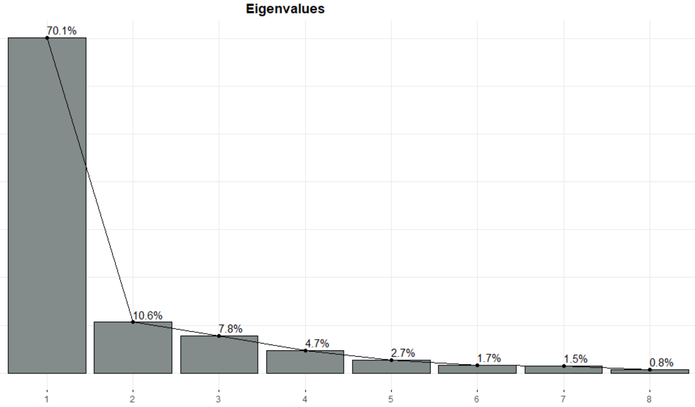
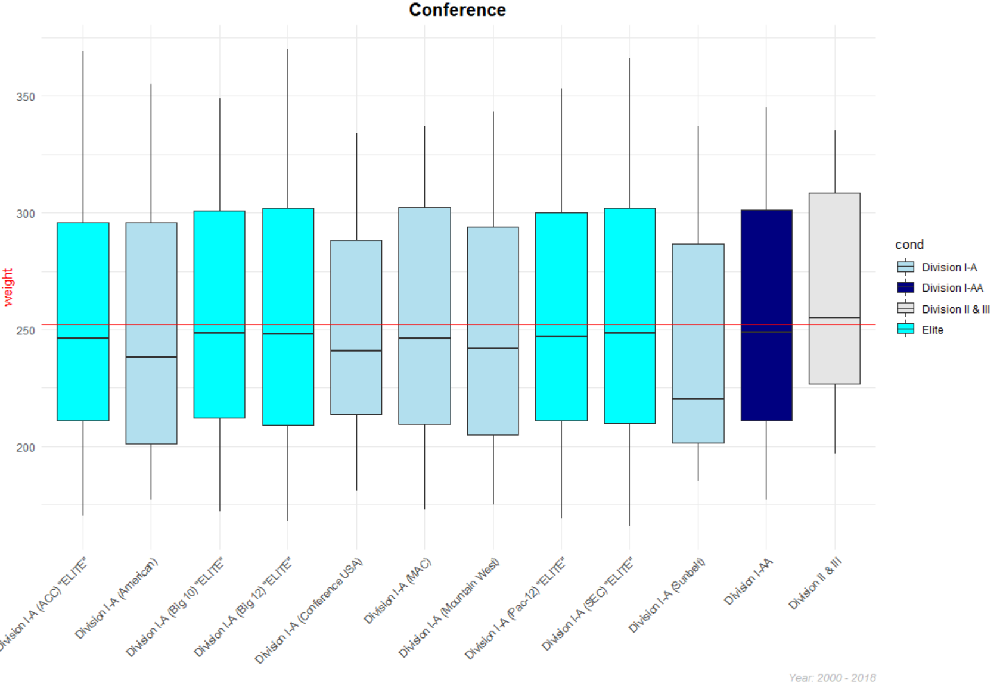
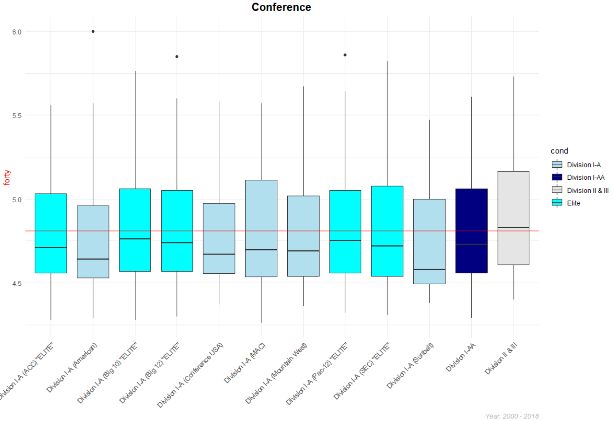
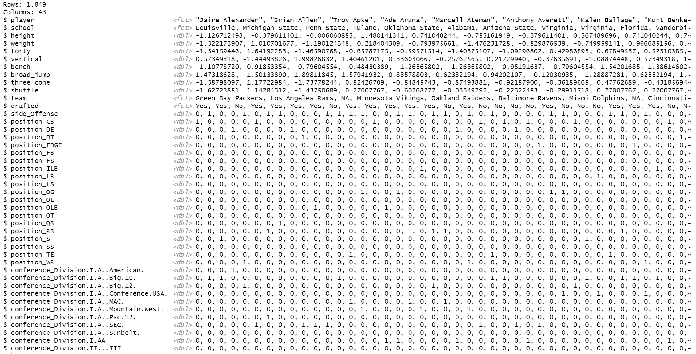
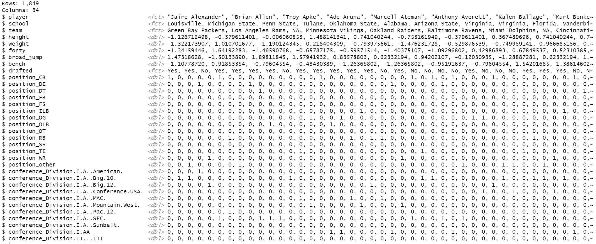
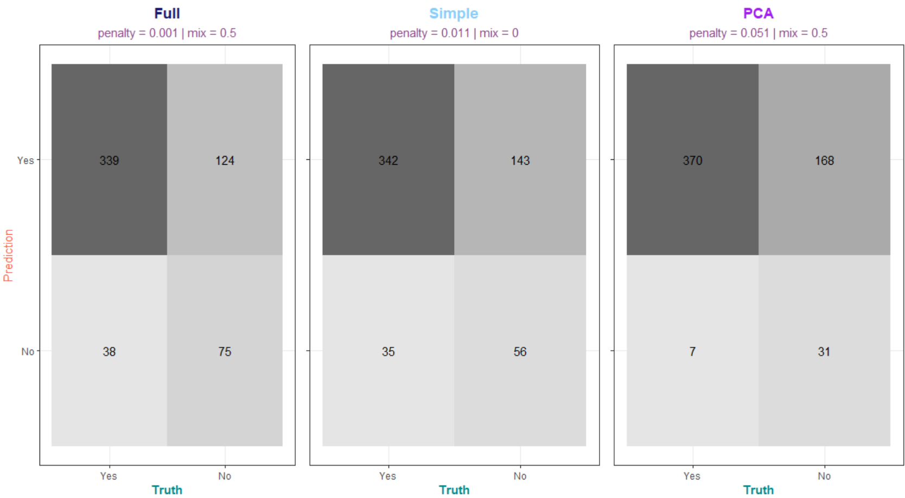
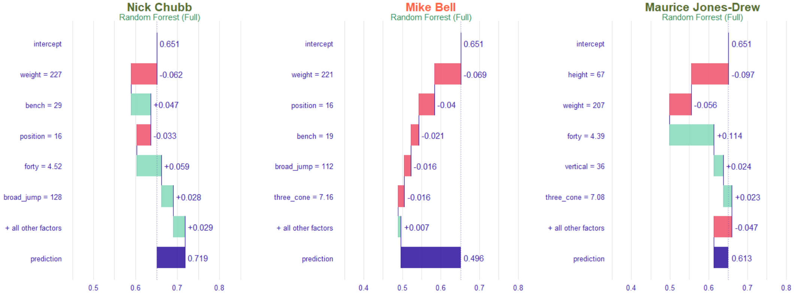
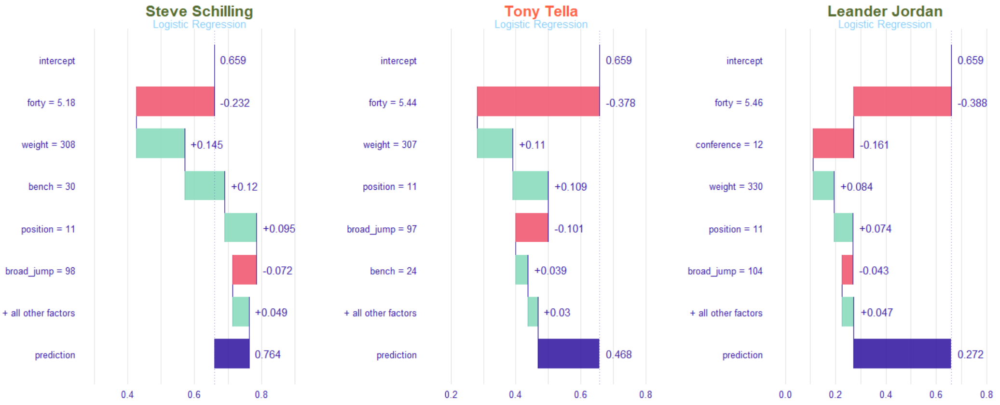
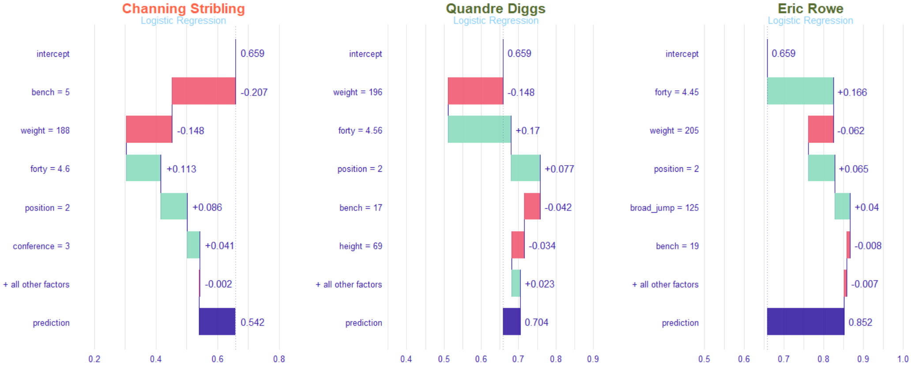
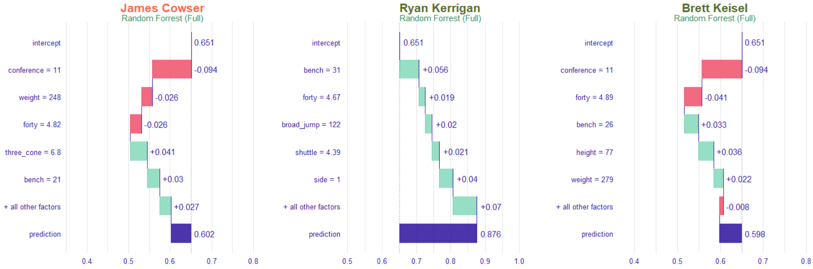

# Project Overview

### Table of Contents
- [Summary](https://github.com/Gmabatah93/PROJECT_NFL_Combine#summary)
- [Exploratory Data Analysis](https://github.com/Gmabatah93/PROJECT_NFL_Combine#exploratory-data-analysis)
- [Modeling](https://github.com/Gmabatah93/PROJECT_NFL_Combine#modeling)
- [Validation Results](https://github.com/Gmabatah93/PROJECT_NFL_Combine#validation-diagnostic)
- [Test Results](https://github.com/Gmabatah93/PROJECT_NFL_Combine#test-results)
- [Prescriptive Analysis](https://github.com/Gmabatah93/PROJECT_NFL_Combine#prescriptive-analysis)
- [Conclusion](https://github.com/Gmabatah93/PROJECT_NFL_Combine#conclusion)

---

### Code Used

Package | version
--- | ---
tidymodels | 0.1.2
stringr | 1.4.0
forcats | 0.5.0
RColorBrewer | 1.1-2
ggmosaic | 0.3.4
ggpubr | 0.4.0
FactoMiner | 2.4
factoextra | 1.0.7
probably | 0.0.6
workflowsets | 0.0.1
doParallel | 1.0.16

### Business Requirement
1. Develop a Model to predict if a player will be drafted
2. Examine the importance of combine results relate to being drafted.

### Data Collection
> This Dataset consist of players who entered the drafted between the year 2000 - 2018

**(raw)**

Feature | Datatype | Description
--- | --- | ---
player | chr | name of the player
position | chr | position player played in college
school | chr | where player played in college
year | dbl | year player entered the draft
height | dbl | height of player _(cm)_
weight | dbl | weight of player _(lbs)_
forty | dbl | how fast player runs 40yards _(seconds)_
vertical | dbl | how high player jumps from a still position _(inches)_
bench | dbl | how many times player can lift 225lbs
broad_jump | dbl | how far can a player jump. From a balanced stance, the player explodes forward as far as he can and must land without moving _(inches)_
three_cone | dbl | primarily run to evaluate the agility, quickness and fluidity of movement _(seconds)_
shuttle | dbl | The shuttle (20yards), much like the 3-cone drill, test speed and acceleration. The only difference is that players are running laterally instead of forming a right angle.  _(seconds)_
drafted | chr | What NFL team drafted player / Round / Pick / Year

**Feature Engineering**

Feature | Description
--- | ---
drafted | split the drafted variable to represent one feature for [Team / Round / Pick / Year] & changed the drafted variable to a factor ["Yes","No"] to represent weather a player was drafted or not.
side | created a new variable for High Level analysis of just offensive players and defensive players.
conference | created a variable to view conference by conference instead of school by school

## Summary
> **EDA Target (Drafted):** \
Of the 2,885 players in this dataset from 2000-2018 **_65%_** was drafted. \
Of the **_65%_** of players that were drafted, most of them came from the **_ELITE ("SEC", "ACC", "Big 10","Big 12", "Pac-12")_** conferences, the top 3 positions were:
> - Defense: **_[ CB | DE | OLB]_**
> - Offense: **_[ OT | WR | RB ]_**

> **PCA:** \
The combine statistics were HIGHLY correlated with each other. \
After performing PCA, it was shown that the first 2 principal components accounted for 80% of the variance in the data. Therefore there were two themes that summarized the data.
> 1. The 1st principal component was represented by **_[ Weight | Forty | Three_cone | shuttle | broad_jump | vertical ]_**. In my opinion, this can best be summarized as a players overall athleticism in regards to **_Agility and Explosiveness_**. Also after looking a the biplot, Forty, Three_cone, and shuttle pretty much represented the same thing so Forty time can essentially represent the 3. Broad_jump & vertical, can just be represented by broad_jump
> 2. The 2nd principal component was represented by **_Bench_**. This simply is the overall **_strength_** of a player.

> **Combine Data**: \
The average _WEIGHT_ for everyone in the dataset was **_252lbs_**. By _Position_: CB = **_193lbs_**, DE = **_268lbs_**, OLB = **_240lbs_**, OT = **_315lbs_**, WR = **_204lbs_**, RB = **_215lbs_**. By _Conference_: Elite = **_253lbs_**, Division I-A = **_246lbs_**, Division I-AA = **_252lbs_**, Divsion II & III = **_266lbs_** .\
The average _FORTY_ for everyone in the dataset was **_4.81secs_**. By _Position_: CB = **_4.49secs_**, DE = **_4.83secs_**, OLB = **_4.68secs_**, OT = **_5.25secs_**, WR = **_4.51secs_**, RB = **_4.56secs_**. By _Conference_ Elite = **_4.81sec_**, Division I-A = **_4.78secs_**, Division I-AA = **_4.82secs_**, Divsion II & III = **_4.89secs_**. \
The average _BENCH_ for everyone in the dataset was **_21reps_**. By _Position_: CB = **_14reps_**, DE = **_24reps_**, OLB = **_23reps_**, OT = **_24reps_**, WR = **_14reps_**, RB = **_20reps_**. By _Conference_: Elite = **_21reps_**, Division I-A = **_21reps_**, Division I-AA = **_21reps_**, Divsion II & III = **_23reps_**. \
The average _BROAD JUMP_ for everyone in the dataset was **_113inches_**. By _Position_: CB = **_122inches_**, DE = **_115inches_**, OLB = **_118inches_**, OT = **_102inches_**, WR = **_121inches_**, RB = **_118inches_**. By _Conference_: Elite = **_113inches_**, Division I-A = **_114inches_**, Division I-AA = **_113inches_**, Divsion II & III = **_112inches_**.

> **MODELING**: \
Metrics: AUC, Accuracy, Sensitivity, Specificity, **F1** ("Used to ultimately to select the best model"). \
The 1st model **Random Forrest** was fit trying three different dataset. 1) As is, meaning no preprocess. 2) using PCA with the first 2 principal components. 3) a simpler dataset removing the highly correlated features. \
The 2nd model **Logistic Regression** was fit trying three different dataset. 1) With minimal preprocessing ("normalized", "dummy"). 2) Minimal preprocessing and PCA using the first 2 principal components. 3) simpler dataset removing the highly correlated features and minimal preprocessing.

> **VALIDATION METRICS**

Model | AUC | Accuracy | Sensitivity | Specificity | Precision | Recall | F1
--- | --- | --- | --- | --- | --- | --- | ---
**_LOG (NORMAL: P = 0.001, M = 0.5)_** | **_0.737_** | **_0.72_** | **_0.907_** | **_0.365_** | **_0.73_** | **_0.907_** | **_0.809_**
LOG (SIMPLE: P = 0.011, M = 0) | 0.725 | 0.696 | 0.914 | 0.283 | 0.707 | 0.914 | 0.797
RF (SIMPLE: mtry = 6, min = 9) | 0.703 | 0.698 | 0.85 | 0.409 | 0.731 | 0.85 | 0.786
RF (NONE: mtry = 1, min = 9) | 0.737 | 0.707 | 0.944 | 0.258 | 0.706 | 0.944 | 0.808

> **TEST METRICS**

Model | AUC | Accuracy | Sensitivity | Specificity | Precision | Recall | F1
--- | --- | --- | --- | --- | --- | --- | ---
**_LOG-Full (P = 0.001, M = 0.5)_** | 0.711 | 0.719 | 0.899 | 0.377 | 0.732 | 0.899 | **_0.807_**
LOG-Simple (P = 0.011, M = 0) | 0.688 | 0.691 | 0.907 | 0.281 | 0.705 | 0.907 | 0.794
RF-Simple (mtry = 6, min = 9) | 0.697 | 0.679 | 0.809 | 0.432 | 0.73 | 0.809 | 0.767
**_RF-Full (mtry = 1, min = 9)_** | 0.7 | 0.693 | **_0.926_** | 0.251 | 0.701 | 0.926 | 0.798

> **PRESCRIPTIVE ANALYSIS:** \
Feature Importance: **_LOG-Full:_** 1) Forty, 2) Weight, 3) Position. **_LOG-Simple:_** 1) Forty, 2) Weight, 3) Position. **_RF-Full:_** 1) Weight, 2) Forty, 3) Bench. \

---

# Exploratory Data Analysis

## Target (Drafted ?)

>**Note (Target)**: Of all the players in this dataset **_65%_** of players in this dataset was Drafted

> **Note (Position)**: There are **1426** Offensive &  **1459** Defensive players in this dataset
> - Of the **1459** Defensive players **70%** was Drafted. Of the **1426** Offensive players **61%** was Drafted.
> - Top 3 Offensive Positions Drafted: OT = **_194_** | WR = **_157_** | RB = **_145_**
> - Top 3 Defensive Positions Drafted: CB = **_229_** | DE = **_192_** | OLB = **_182_**

> **Note (Conference)**: The majority of players Drafted came from the "ELITE" Conferences

## Correlation

> **Note (Correlation)**: Alot of the Combine metrics are **_Highly_** Corelated

## Principal Component Analysis
> Because a lot of the combine features were Highly correlated I will use PCA to hopefully identify related themes between these variables.

  
  

> **Note (PCA)**:
> - **PC1 - Theme:**  _Represents Agility/Explosiveness_
>   + **_Agility_**: forty | three_cone | shuttle
>     + generally if your fast in one your fast in the others
>   + **_Explosiveness_**: vertical | broad_jump
>     + generally if you can jump well vertically you can jump well horizontally
> - **PC2 - Theme**: _Represents overall strength_

## Combine Summary
> With the help of PCA I can say that the combine features **(Weight, Forty, Bench, and Broad Jump)** best summaries the athletics ability of players entering the draft. So we'll view these features by Position & Conference.

### Weight

**Note (Weight)**: Average weight for players in this dataset is **_252lbs_**
- Offense: **_262lbs_**
  + Average weight for **OT** is **_315lbs_** for both drafted and non drafted players
  + Average weight for **WR** is **_204lbs_** for both drafted and non drafted players
  + Average weight for **RB** is **_215lbs_** for both drafted and non drafted players
- Defense: **_242lbs_**
  + Average weight for **CB** is **_193lbs_** for both drafted and non drafted players
  + Average weight for **DE** is **_268lbs_** for both drafted and non drafted players
  + Average weight for **OLB** is around **_240lbs_** for both drafted and non drafted players
- Conference: Averages
  + Elite = **_253lbs_** | Division I-A = **_246lbs_** | Division I-AA = **_252_** | Division II & II = **_266lbs_**

### Forty

**Note (Forty):** Average forty for players in this dataset is **_4.81secs_**
- Offense: **_4.72secs_**
  + Average forty for **OT**: Drafted = **_5.21_** | Not Drafted = **_5.34_**
  + Average forty for **WR**: Drafted = **_4.47_** | Not Drafted = **_4.55_**
  + Average forty for **RB**: Drafted = **_4.52_** | Not Drafted = **_4.61_**
- Defense: **_4.90secs_**
  + Average forty for **CB**: Drafted = **_4.47_** | Not Drafted = **_4.54_**
  + Average forty for **DE**: Drafted = **_4.80_** | Not Drafted = **_4.89_**
  + Average forty for **OLB**: Drafted = **_4.65_** | Not Drafted = **_4.74_**
- Conference: Averages
  + Elite = **_4.81secs_** | Division I-A = **_4.78secs_** | Division I-AA = **_4.82secs_** | Division II & II = **_4.89secs_**

### Bench

**Note (Bench):** Average bench for players in this dataset is **_21reps_**
- Offense: **_21reps_**
  + Average bench for **OT**: Drafted = **_25reps_** | Not Drafted = **_23reps_**
  + Average bench for **WR** was **_14reps_** for both drafted and non drafted players
  + Average bench for **RB**: Drafted = **_20reps_** | Not Drafted = **_19reps_**
- Defense: **_21reps_**
  + Average bench for **CB**: Drafted = **_15reps_** | Not Drafted = **_13reps_**
  + Average bench for **DE**: Drafted = **_24reps_** | Not Drafted = **_23reps_**
  + Average bench for **OLB**: Drafted = **_23reps_** | Not Drafted = **_21reps_**
- Conference: Averages
  + Elite = **_21reps_** | Division I-A = **_21reps_** | Division I-AA = **_21reps_** | Division II & II = **_23reps_**

### Broad Jump

**Note (Jump):** Average broad jump for players in this dataset is **_113inches**
- Offense: **_110inches_**
  + Average broad jump for **OT**: Drafted = **_103inches_** | Not Drafted = **_100inches_**
  + Average broad jump for **WR**: Drafted = **_121inches_** | Not Drafted = **_119inches_**
  + Average broad jump for **RB**: Drafted = **_119inches_** | Not Drafted = **_117inches_**
- Defense: **_116inches_**
  + Average broad jump for **CB**: Drafted = **_122inches_** | Not Drafted = **_120inches_**
  + Average broad jump for **DE**: Drafted = **_115inches_** | Not Drafted = **_113inches_**
  + Average broad jump for **OLB**: Drafted = **_118inches_** | Not Drafted = **_115inches_**
- Conference: Averages
  + Elite = **_113inches_** | Division I-A = **_114inches_** | Division I-AA = **_113inches_** | Division II & II = **_112inches_**

---

# Modeling
> The Models I'm going to use for this dataset is
> - **Random Forrest**: because of its versatility _(as you see alot of features in this dataset is correlated, so we'd have to deal with that issue)_ with **RF** you don't even have to preprocess correlated features, it knows how to handle it.
> - **Logistic Regression**: because it is a more interpretable model and if we can get close to the same metrics as **RF** I'd rather use **LR**, however we would have to do alot of preprocessing.

## Data Spending

> **Note (Split)**
> - **Split 1**: stratified by drafted feature
>   + 80%: NFL Other
>   + 20%: NFL Test **_(This will be the final test set)_**
> - **Split 2**: splitting _"NFL Other"_ stratified by drafted feature
>   + 80%: NFL Train **_(This will be the data I use to train the models)_**
>        + **_I will be 10-Fold CV to tune each model_**
>   + 20%: NFL Val: **_(Will be the final assessment before using the Test Set)_**

## Preprocess - Random Forrest

#### NONE

**Model Data**

#### PCA

**Components**

**Model Data**

#### Simple

**Model Data**

> **Note (RF - Preprocess):** I will be fitting three different datasets to see how they perform.
> - One using the raw NFL Train dataset, One using the dataset preprocessed by PCA, and Another simplified dataset taking out the correlated features
> - _(player, school, team will not be used in the model) it is used as an ID_

## Preprocess - Logistic Regression

#### NORMAL
**Model Data**

#### PCA

**Model Data**

### Simple

**Model Data**  

> **Note (LR - Preprocess)**
> - LR will need a little bit more preprocessing. 1st I normalized all the numeric features. Then I "dummified" the categorical features (side, position, conference)
> - I also took the same approach I used for **RF** by fitting one dataset with Minimal "NORMAL" preprocessing, another using PCA, and another taking out the correlated features.  
> - _(player, school, team will not be used in the model) it is used as an ID_

### Metrics
 - **AUC:** Measure of performance across all possible class
 - **Accuracy:** What percentage did the model correctly predicted who got drafted and who didn't
 - **Sensitivity:** Out of all the players that got actually got drafted what percentage did the model predict correctly
 - **Specificity:** Out of all the players that got did not get drafted what percentage did the model predict correctly
 - **Precision:** Out of all the players the Model predicted got Drafted what percentage actually got Drafted ?
 - **F1:** Balance between Precision and Recall "Sensitivity"
  + ultimately I will be using *F score* to select the best model

## Fit

### Random Forest

**Grid**

> **Note (RF - Tune):** I fit all Models using 1,000 trees and tried **mtry 1-8** _"Number of random features to try for each split"_ and **min_n 1-10** _"min number of samples to have in leaf node"_

#### **10-Fold CV Metrics**

Preprocess | Metric | mtry | min_n | Stat
--- | --- | --- | --- | ---
None | Accuracy | 1 | 9 | 69.6%
PCA  | Accuracy | 1 | 5 | 68.2%
**_Simple_** | **_Accuracy_** | **_6_** | **_9_** | **_70.5%_**
**_None_** | **_F Score_** | **_1_** | **_9_** | **_79.9%_**
PCA  | F Score | 1 | 5 | 79.1%
Simple | F Score | 1 | 3 | 79.6%

> **Note (RF - CV Metrics):** After fitting all the different models the best model in terms of Accuracy was the one with a **Simple** preprocess with **mtry = 6 & min_n = 9**. The best model in terms of **F Score** was with **No Preprocess** with **mtry = 1 & min_n = 9**

### Logistic Regression

> **Note (LOG - Tune):** I fit all Models trying **penalty 0.001 - 0.1** _"cost placed for misclassifications"_ and **mixture (0, 0.5, 1)** _"lasso, mix, ridge"_

### **10-Fold CV Metrics**

Preprocess | Metric | Penalty | Mixture | Stat
--- | --- | --- | --- | ---
**_Normal_** | **_Accuracy_** | **_0.001_** | **_0.5_** | **_71.7%_**
PCA  |  Accuracy | 0.021 | 0 | 69.9%
Simple |  Accuracy | 0.001 | 0 | 70.7%
Normal | F Score | 0.006 | 0.5 | 80.3%
PCA  |  F Score | 0.051 | 0.5 | 80.1%
**_Simple_** |  **_F Score_** | **_0.011_** | **_0_** | **_80.5%_**

> **Note (LOG - CV Metrics):** After fitting all the different models the best model in terms of Accuracy was the one with a **Normal** preprocess with **penalty = 0.001 & Mixture = 0.5**. The best model in terms of **F Score** was with **Simple** preprocess with **penalty = 0 & mixture = 0 "LASSO"**

---

# Validation Diagnostic

## Random Forrest

### ROC Curve

### Confusion Matrix

## Logistic Regression

### ROC Curve

### Confusion Matrix

## Validation Metrics
Model | AUC | Accuracy | Sensitivity | Specificity | Precision | Recall | F1
--- | --- | --- | --- | --- | --- | --- | ---
RF-Full | 0.737 | 0.707 | 0.944 | 0.258 | 0.706 | 0.944 | 0.808
RF-Simple | 0.703 | 0.698 | 0.85 | 0.409 | 0.731 | 0.85 | 0.786
RF-PCA | 0.701 | 0.667 | 0.937 | 0.157 | 0.678 | 0.937 | 0.787
**_LOG-Full_** | **_0.737_** | **_0.72_** | **_0.907_** | **_0.365_** | **_0.73_** | **_0.907_** | **_0.809_**
LOG-Simple | 0.725 | 0.696 | 0.914 | 0.283 | 0.707 | 0.914 | 0.797
LOG-PCA | 0.657 | 0.678 | 0.963 | 0.138 | 0.679 | 0.963 | 0.797

> **Note (Validation Results):** After comparing the models using the validation set. The best model was **Logistic Regression using NORMAL preprocess (penalty = 0.001, mixture = 0.5)**

---
# Test Results

## ROC Curve

## Confusion Matrix
**Logistic Regression**

**Random Forrest**

## Metrics  

Model | AUC | Accuracy | Sensitivity | Specificity | Precision | Recall | F1
--- | --- | --- | --- | --- | --- | --- | ---
**LOG-Full** | **_0.711_** | **_0.719_** | 0.899 | 0.377 | **_0.732_** | 0.899 | 0.807
LOG-Simple | 0.688 | 0.691 | 0.907 | 0.281 | 0.705 | 0.907 | 0.794
LOG-PCA | 0.633 | 0.696 | **_0.981_** | 0.156 | 0.688 | 0.981 | **_0.809_**
RF-Full | 0.7 | 0.693 | 0.926 | 0.251 | 0.701 | 0.926 | 0.798
RF-Simple (mtry = 6, min = 9) | 0.697 | 0.679 | 0.809 | 0.432 | 0.73 | 0.809 | 0.767
RF-PCA | 0.676 | 0.684 | 0.944 | 0.191 | 0.689 | 0.944 | 0.796

> **Note (Test Results):** After comparing the models using the Test set. Below is the best model for each metric.

> **AUC:**
1. **80.9%** Logistic Regression - PCA
2. **80.7%** Logistic Regression - Full
3. **79.8%** Random Forrest - Full

> **Accuracy:**
1. **71.9%** Logistic Regression - Full
2. **69.6%** Logistic Regression - PCA
3. **69.3%** Random Forrest - Full

> **Sensitivity:**
1. **98.1%** Logistic Regression - PCA
2. **94.4%** Random Forrest - PCA
3. **92.6%** Random Forrest - Full

> **Precision:**
1. **73.2%** Logistic Regression - Full
2. **73%** Random Forrest - Simple
3. **70.5%** Logistic Regression - Simple

> **F Score:**
1. **80.9%** Logistic Regression - PCA
2. **80.7%** Logistic Regression - Full
3. **79.8%** Random Forrest - Full

---

# Prescriptive Analysis
> After fitting a model an importance aspect of model assessment is to evaluate which features are important and how they effect the target variable, which in this case is the probability of a player being drafted. For this dataset I will be utilizing the DALEX package which uses a model-agnostic approach to asses feature importance

> Based on the Test Results the models I choose to evaluate further is 1) Logistic Regression - PCA 2) Logistic Regression - Full 3) Random Forrest - Full

## Feature Importance
> To calculate feature importance the DALEX package first calculates the Loss of the normal model then permutes the variable of the feature in question. And finally takes the difference between the two. _(In this case I used AUC as the Loss Metric)_  

> **Note: (Variable Importance)**
> - **Logistic Regression (Full)**
>   1. Forty = 0.14
>   2. Weight = 0.135
>   3. Position = 0.064
>   4. Three Cone = 0.033
>   5. Side = 0.026
> - **Logistic Regression (Simple)**
>   1. Forty = 0.121
>   2. Weight = 0.074
>   3. Position = 0.044
>   4. Bench = 0.039
>   5. Broad Jump = 0.02
> - **Random Forrest (Full)**
>   1. Weight = 0.061
>   2. Forty = 0.051
>   3. Bench = 0.027
>   4. Three Cone = 0.016
>   5. Vertical 0.016

> _For all models assessed **Forty & Weight** were the most important features effecting the probability of a player being drafted_

> **Note (Final Model Evaluation):** Although Logistic Regresison using NORMAL preprocessing was the best model overall, LR using **SIMPLE** preprocessing was really close and the benefit it is a much simpler model so moving forward I will be evaluating **Logistic Regression SIMPLE and Random Forrest NONE**.

## Partial Dependency
> Shows how the expected value of model prediction behave as a function of a selected feature.

> **Note (pdp Continuous)**

> **BENCH:** From EDA average Bench Reps for the entire dataset was **_21 reps_**
> - **Both Models** captures the general shape that as bench reps increase so those the probability of a certain player being drafted.   
> - **Random Forrest** on average all players in this dataset _based on bench reps_ are predicted to be drafted. It also shows that the relationship between bench reps and the probability of being drafted is monotonic.
> - **Logistic Regression** players that have a _bench rep below 10 reps_ are predicted on average to not be drafted.

> **FORTY**: From EDA average 40 time for the entire dataset was **_4.8 secs_**
> - **Both Models** show that as 40 time increases the probability of a player being drafted decreases.
> - **Random Forrest** shows that relationship is monotonic showing a bit of a sharp decrease as 40 time approaches 5.0 seconds. However **RF** still predicts in on average all players to be drafted just based on 40 time.
> - **Logistic Regression** also captures the general relationship of 40 time and the probability of being drafted. However as 40 time approaches 5.0 seconds **Logistic Regression** starts to predict players not being drafted.

> **WEIGHT:** From EDA average Weight for the entire dataset was **_251lbs_**
> - **Both Models** show that in general as weight increases so those the probability of a player being drafted.
> -**Random Forrest** shows that the relationship between weight and the probability of being drafted is monotonic. **RF** also predicts on average all players to be drafted to be drafted just based on weight.
> - **Logistic Regression** also captures the general shape that as weight increases so those the probability of a player being drafted. However, if a certain player weighs below 200 **LR** just based on weight will predict that player as not being drafted.

> **Note (pdp Conference)**

> **CONFERENCE:**
> - **Random Forrest**: just based on conference, shows no matter which conference the player plays for the model will predict them as being drafted, However if a player played for a school in Division I-AA, II, III the probability decreases.
> - **Logistic Regression** predicts if the player plays for the Sunbelt Conference will have the highest probability of being drafted. If the player plays for the Division I-AA, II, III the player will probably not be drafted.

> **Note (pdp Position)**

> **POSITION:**
> - **_Random Forrest_**: in general if your just differentiating by position the model predicts all position to be drafted. You also don't see a lot a variability, All being around 60%. It does dips slightly when you look at positions (QB, RB, S, SS, TE WR).
> - **_Logistic Regression_**: you see all lot a variability in the probability of being drafted factored by position. _Offensive Guards & Tackles_ have the highest probability of being drafted at around 70-80%. Edge Rushers, Long Snappers, Quarterbacks, and Safety have lowest probability of being drafted at around 20%

### Partial Dependency: (Conference)

> **Note (Random Forrest- Conference)**

> **BENCH:** From EDA average Bench by Division **_[Elite = 21reps | Division I-A = 21reps | Division I-AA = 21reps | Division II & II = 23reps ]_**
> - At a High-Level no matter which conference a player plays for as there bench reps increases so does the probability of them being drafted.
> - What stands out is that players that played for a school in the Division I - AA that a bench rep below 18, the model predicts them as not being drafted

> **FORTY:** From EDA average 40 time by Division **_[ Elite = 4.81secs | Division I-A = 4.78secs | Division I-AA = 4.82secs | Division II & II = 4.89secs ]_**
> - At a High-Level no matter which conference a player plays for as there 40 time increases the probability of them being drafted decreases.
> - What stands out is, for a player that played for a school in Division II or III, does not run a 40 time of at least 4.4. There probability of being drafted decreases significantly.

> **WEIGHT:** From EDA average Weight time by Division **_[ Elite = 253lbs | Division I-A = 246lbs | Division I-AA = 252 | Division II & II = 266lbs ]_**
> - At a High-Level no matter which conference a player plays for as there weight increases so does the probability of them being drafted.

> **Note (Logistic Regression - Conference)**

> **BENCH:** From EDA average Bench by Division **_[Elite = 21reps | Division I-A = 21reps | Division I-AA = 21reps | Division II & II = 23reps ]_**
> - At a High-Level no matter which conference a player plays for as there bench reps increases so does the probability of them being drafted.
> - What stands out is **For players that played in the Division II or III conference**. They would need to bench at least 25 for them to be drafted

> **FORTY:** From EDA average 40 time by Division **_[ Elite = 4.81secs | Division I-A = 4.78secs | Division I-AA = 4.82secs | Division II & II = 4.89secs ]_**
> - At a High-Level no matter which conference a player plays for as there 40 time increases the probability of them being drafted decreases.

> **WEIGHT:** From EDA average Weight time by Division **_[ Elite = 253lbs | Division I-A = 246lbs | Division I-AA = 252 | Division II & II = 266lbs ]_**
> - At a High-Level no matter which conference a player plays for as there weight increases so does the probability of them being drafted.

> **GENERAL:** Players that played in the **Division II or III conferences** would need to perform significantly better than average in the combine to have an equal probability of being drafted for players that played in the more "ELITE" conferences

### Partial Dependency: (Position)
> After some research I determined that (WR, RB, OG) were the most important/ popular offensive players that teams look for in the draft and (CB, DE) were the most important defensive players.

> **Note (Random Forrest - Position)**

> **BENCH:** From EDA average Bench by Position **_[ CB = 14reps | DE = 24reps | OG = 26reps | RB = 20reps | WR = 14reps ]_**
> - At A High- Level it still sticks with the same general relationship, As you bench reps increase so those the probability of a player being drafted.
> - It looks like no matter the position if your able to bench over 20 reps the probability of you being drafted increase to above 50%

> **FORTY:** From EDA average 40 time by Position **_[ CB = 4.49secs | DE = 4.83secs | OG = 5.31secs | RB = 4.56secs | WR = 4.51secs ]_**
> - At A High- Level it still sticks with the same general relationship, As you 40 times increase the probability of a player being drafted decreases.

> **WEIGHT:** From EDA average Weight by Position **_[ CB = 193lbs | DE = 268lbs | OG = 314lbs | RB = 216lbs | WR = 203lbs ]_**
> - At A High- Level it still sticks with the same general relationship, As you weight increase so those the probability of a player being drafted.
> - What stands out is OG that weight below 300, the model predicts them as probably not being drafted.

> **Note (Logistic Regression - Position)**

> **BENCH:** From EDA average Bench by Position **_[ CB = 14reps | DE = 24reps | OG = 26reps | RB = 20reps | WR = 14reps ]_**
> - At A High- Level it still sticks with the same general relationship, As you bench reps increase so those the probability of a player being drafted.
> - What stands out is what a CB benches does not matter to much in terms of getting drafted

> **FORTY:** From EDA average 40 time by Position **_[ CB = 4.49secs | DE = 4.83secs | OG = 5.31secs | RB = 4.56secs | WR = 4.51secs ]_**
> - At A High- Level it still sticks with the same general relationship, As you 40 times increase the probability of a player being drafted decreases.
> - What stands out is if a (WR CB) does not run at least around  4.6 secs he will probably not get drafted

> **WEIGHT:** From EDA average Weight by Position **_[ CB = 193lbs | DE = 268lbs | OG = 314lbs | RB = 216lbs | WR = 203lbs ]_**
> - At A High- Level it still sticks with the same general relationship, As you weight increase so those the probability of a player being drafted.
> - What stands out is OG must weigh at least 280 to have a chance of being drafted

## Instance-Level
> After assessing the models at a dataset level we'll take some samples from each position and do further evaluation. \
**Break-Down Plots:** Shows which variables contributes to the results the most. _(The underlying idea capture the contribution of a feature to the model’s prediction by computing the shift in the expected value of **Y** while fixing the values of other variables)_

**Samples**

Position | Accuracy | Sensitivity | Specificity | Precision | F1
--- | --- | --- | --- | --- | ---
Wide Receivers | 0.774 | 0.97 | 0.45 | 0.744 | 0.842
Running Backs | 0.75 | 0.9 | 0.5 | 0.75 | 0.818
Offensive Guards | 0.646 | 0.92 | 0.348 | 0.605 | 0.730
Corner Backs | 0.696 | 0.974 | 0.059 | 0.704 | 0.817
Defensive Ends | 0.656 | 0.884 | 0.111 | 0.704 | 0.784

Position | Accuracy | Sensitivity | Specificity | Precision | F1
--- | --- | --- | --- | --- | ---
Wide Receivers | 0.736 | 0.879 | 0.5 | 0.744 | 0.806
Running Backs | 0.75 | 0.9 | 0.5 | 0.75 | 0.818
Offensive Guards | 0.583 | 0.8 | 0.348 | 0.571 | 0.667
Corner Backs | 0.679 | 0.974 | 0 | 0.691 | 0.809
Defensive Ends | 0.656 | 0.860 | 0.167 | 0.712 | 0.779

> **Note (Metrics)**: In terms of **F1 Score** Random Forrest is out performing Logistic Regression, However by a small margin

### Wide Receivers

**Break-Down**

> **Note (WR)**

### Running Backs

**Break-Down**

### Offensive Guards

**Break-Down**

### Cornerbacks

**Break-Down**

### Defensive Ends

**Break-Down**

# Conclusion
