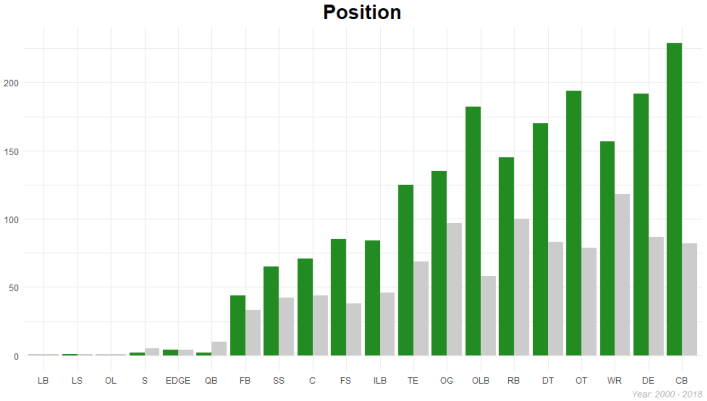
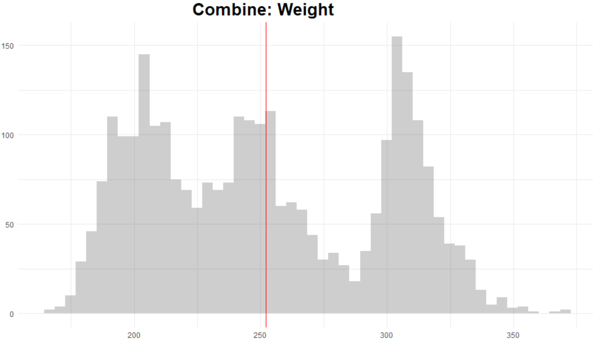
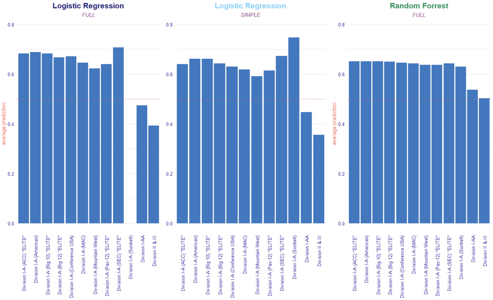

### Table of Contents

---
# Project Overview

## Summary

### Code Used

Package | version
--- | ---
tidymodels | 0.1.2
stringr | 1.4.0
forcats | 0.5.0
RColorBrewer | 1.1-2
ggmosaic | 0.3.4
ggpubr | 0.4.0
FactoMiner | 2.4
factoextra | 1.0.7
probably | 0.0.6
workflowsets | 0.0.1
doParallel | 1.0.16

### Business Requirement
1. Develop a Model to predict if a player will be drafted
2. Examine the importance of combine results relate to being drafted.

### Data Collection
**(raw)**

Feature | Datatype | Description
--- | --- | ---
player | chr | name of the player
position | chr | position player played in college
school | chr | where player played in college
year | dbl | year player entered the draft
height | dbl | height of player _(cm)_
weight | dbl | weight of player _(lbs)_
forty | dbl | how fast player runs 40yards _(seconds)_
vertical | dbl | how high player jumps from a still position _(inches)_
bench | dbl | how many times player can lift 225lbs
broad_jump | dbl | how far can a player jump. From a balanced stance, the player explodes forward as far as he can and must land without moving _(inches)_
three_cone | dbl | primarily run to evaluate the agility, quickness and fluidity of movement _(seconds)_
shuttle | dbl | The shuttle (20yards), much like the 3-cone drill, test speed and acceleration. The only difference is that players are running laterally instead of forming a right angle.  _(seconds)_
drafted | chr | What NFL team drafted player / Round / Pick / Year

---

# Exploratory Data Analysis

## Summary

**Note (Target)**: Of all the players in this data **_65%_** of players in this dataset was Drafted

**Note (Position)**: There are _1459_ Defensive and _1426_ Offensive players in this dataset
- Of the _1459_ Defensive players **70%** was Drafted. Of the _1426_ Offensive players **61%** was Drafted.
- Top 3 Offensive Positions Drafted: **_OT | WR | RB_**
- Top 3 Defensive Positions Drafted: **_CB | DE | OLB_**

**Note (Conference)**: The majority of players Drafted came from the **_[ SEC | ACC | Big 10 ]_** Conferences

## Correlation

**Note (Correlation)**: Alot of the Combine metrics are **_Highly_** Corelated

## Principal Component Analysis

  
  

**Note (PCA)**:
- **PC1**: Represents Agility/Explosiveness
  + Agility: forty | three_cone | shuttle
    + generally if your fast in one your fast in the others
  + Explosiveness: vertical | broad_jump
    + generally if you can jump well vertically you can jump well horizontally
- **PC2**: Represents overall strength

## Combine Summary

### Weight

**Note (Weight)**: Average weight for players in this dataset is **_252lbs_**
- Offense: **_262lbs_**
  + Average weight for **OT** is **_315lbs_** for both drafted and non drafted players
  + Average weight for **WR** is **_204lbs_** for both drafted and non drafted players
  + Average weight for **RB** is **_215lbs_** for both drafted and non drafted players
- Defense: **_242lbs_**
  + Average weight for **CB** is **_193lbs_** for both drafted and non drafted players
  + Average weight for **DE** is **_268lbs_** for both drafted and non drafted players
  + Average weight for **OLB** is around **_240lbs_** for both drafted and non drafted players
- Conference: Averages
  + Elite = **_253lbs_** | Division I-A = **_246lbs_** | Division I-AA = **_252_** | Division II & II = **_266lbs_**

### Forty

**Note (Forty):** Average forty for players in this dataset is **_4.81secs_**
- Offense: **_4.72secs_**
  + Average forty for **OT**: Drafted = **_5.21_** | Not Drafted = **_5.34_**
  + Average forty for **WR**: Drafted = **_4.47_** | Not Drafted = **_4.55_**
  + Average forty for **RB**: Drafted = **_4.52_** | Not Drafted = **_4.61_**
- Defense: **_4.90secs_**
  + Average forty for **CB**: Drafted = **_4.47_** | Not Drafted = **_4.54_**
  + Average forty for **DE**: Drafted = **_4.80_** | Not Drafted = **_4.89_**
  + Average forty for **OLB**: Drafted = **_4.65_** | Not Drafted = **_4.74_**
- Conference: Averages
  + Elite = **_4.81secs_** | Division I-A = **_4.78secs_** | Division I-AA = **_4.82secs_** | Division II & II = **_4.89secs_**

### Bench

**Note (Bench):** Average bench for players in this dataset is **_21reps_**
- Offense: **_21reps_**
  + Average bench for **OT**: Drafted = **_25reps_** | Not Drafted = **_23reps_**
  + Average bench for **WR** was **_14reps_** for both drafted and non drafted players
  + Average bench for **RB**: Drafted = **_20reps_** | Not Drafted = **_19reps_**
- Defense: **_21reps_**
  + Average bench for **CB**: Drafted = **_15reps_** | Not Drafted = **_13reps_**
  + Average bench for **DE**: Drafted = **_24reps_** | Not Drafted = **_23reps_**
  + Average bench for **OLB**: Drafted = **_23reps_** | Not Drafted = **_21reps_**
- Conference: Averages
  + Elite = **_21reps_** | Division I-A = **_21reps_** | Division I-AA = **_21reps_** | Division II & II = **_23reps_**

### Broad Jump

**Note (Jump):** Average broad jump for players in this dataset is **_113inches**
- Offense: **_110inches_**
  + Average broad jump for **OT**: Drafted = **_103inches_** | Not Drafted = **_100inches_**
  + Average broad jump for **WR**: Drafted = **_121inches_** | Not Drafted = **_119inches_**
  + Average broad jump for **RB**: Drafted = **_119inches_** | Not Drafted = **_117inches_**
- Defense: **_116inches_**
  + Average broad jump for **CB**: Drafted = **_122inches_** | Not Drafted = **_120inches_**
  + Average broad jump for **DE**: Drafted = **_115inches_** | Not Drafted = **_113inches_**
  + Average broad jump for **OLB**: Drafted = **_118inches_** | Not Drafted = **_115inches_**
- Conference: Averages
  + Elite = **_113inches_** | Division I-A = **_114inches_** | Division I-AA = **_113inches_** | Division II & II = **_112inches_**

---

# Modeling

## Preprocess

**Split**

- **Train**: 80% stratified by drafted feature
- **Test**: 20% stratified by drafted feature
- **Validation**: 10 fold cross-validation using the training set

## Preprocess - Logistic Regression

#### NORMAL
- **Normalize**: All numeric variables
- **Dummy**: All categorical variables

**Model Data**

#### PCA

**Components**

**Model Data**

### Simple

**Model Data**  

## Preprocess - Random Forrest

#### NORMAL

**Model Data**

#### PCA

**Model Data**

#### Simple

**Model Data**

### Control
- **Parallel Processing**

### Metrics
 - **AUC:** Measure of performance across all possible class
 - **Accuracy:** What percentage did the model correctly predicted who got drafted and who didn't
 - **Sensitivity:** Out of all the players that got actually got drafted what percentage did the model predict correctly
 - **Specificity:** Out of all the players that got did not get drafted what percentage did the model predict correctly
 - **Precision:** Out of all the players the Model predicted got Drafted what percentage actually got Drafted ?
 - **F1:** Balance between Precision and Recall "Sensitivity"

## Fit

### Logistic Regression

### **Best Metrics**

Preprocess | Metric | Penalty | Mixture | Stat
--- | --- | --- | --- | ---
**_Normal_** | **_Accuracy_** | **_0.001_** | **_0.5_** | **_71.7%_**
PCA  |  Accuracy | 0.021 | 0 | 69.9%
Simple |  Accuracy | 0.001 | 0 | 70.7%
Normal | F Score | 0.006 | 0.5 | 80.3%
PCA  |  F Score | 0.051 | 0.5 | 80.1%
**_Simple_** |  **_F Score_** | **_0.011_** | **_0_** | **_80.5%_**

### Random Forest

**Grid**

#### **Best Metrics**

Preprocess | Metric | mtry | min_n | Stat
--- | --- | --- | --- | ---
None | Accuracy | 1 | 9 | 69.6%
PCA  | Accuracy | 1 | 5 | 68.2%
**_Simple_** | **_Accuracy_** | **_6_** | **_9_** | **_70.5%_**
**_None_** | **_F Score_** | **_1_** | **_9_** | **_79.9%_**
PCA  | F Score | 1 | 5 | 79.1%
Simple | F Score | 1 | 3 | 79.6%

---

# Validation Diagnostic

## Logistic Regression

### ROC Curve

### Confusion Matrix

## Random Forrest

### ROC Curve

### Confusion Matrix

## Validation Metrics
Model | AUC | Accuracy | Sensitivity | Specificity | Precision | Recall | F1
--- | --- | --- | --- | --- | --- | --- | ---
**_LOG-Acc NORMAL (P = 0.001, M = 0.5)_** | **_0.737_** | **_0.72_** | **_0.907_** | **_0.365_** | **_0.73_** | **_0.907_** | **_0.809_**
LOG-F SIMPLE (P = 0.011, M = 0) | 0.725 | 0.696 | 0.914 | 0.283 | 0.707 | 0.914 | 0.797
RF-Acc SIMPLE (mtry = 6, min = 9) | 0.703 | 0.698 | 0.85 | 0.409 | 0.731 | 0.85 | 0.786
RF-F NONE (mtry = 1, min = 9) | 0.737 | 0.707 | 0.944 | 0.258 | 0.706 | 0.944 | 0.808

---
# Test Results

## ROC Curve

## Confusion Matrix
**Logistic Regression**

**Random Forrest**

## Metrics  

Model | AUC | Accuracy | Sensitivity | Specificity | Precision | Recall | F1
--- | --- | --- | --- | --- | --- | --- | ---
**_LOG-Acc NORMAL (P = 0.001, M = 0.5)_** | 0.711 | 0.719 | 0.899 | 0.377 | 0.732 | 0.899 | **_0.807_**
LOG-F SIMPLE (P = 0.011, M = 0) | 0.688 | 0.691 | 0.907 | 0.281 | 0.705 | 0.907 | 0.794
RF-Acc SIMPLE (mtry = 6, min = 9) | 0.697 | 0.679 | 0.809 | 0.432 | 0.73 | 0.809 | 0.767
**_RF-F NONE (mtry = 1, min = 9)_** | 0.7 | 0.693 | **_0.926_** | 0.251 | 0.701 | 0.926 | 0.798

**Top (AUC):** Logistic Regression-Acc _(NORMAL: P = 0.001, M = 0.5)_ - **71.1%**

**Top (Accuracy):** Logistic Regression-Acc _(NORMAL: P = 0.001, M = 0.5)_ - **71.9%**

**Top (Sensitivity):** Random Forrest-F _(NONE: mtry = 1, min = 9)_ - **92.6%**

**Top (Precision):** Logistic Regression-Acc _(NORMAL: P = 0.001, M = 0.5)_ - **78.6%**

**Top (F Score):** Logistic Regression-Acc _(NORMAL: P = 0.001, M = 0.5)_ - **80.7%**

# Prescriptive Analysis

## Feature Importance

> **Note: (Variable Importance)**
- **Logistic Regression (NORMAL)**
  1. Forty = 0.14
  2. Weight = 0.135
  3. Position = 0.064
  4. Three Cone = 0.033
  5. Side = 0.026
  6. Bench = 0.018
- **Logistic Regression (SIMPLE)**
  1. Forty = 0.121
  2. Weight = 0.074
  3. Position = 0.044
  4. Bench = 0.039
  5. Broad Jump = 0.02
  6. Conference = 0.016
- **Random Forrest (NONE)**
  1. Weight = 0.061
  2. Forty = 0.051
  3. Bench = 0.027
  4. Three Cone = 0.016
  5. Vertical 0.016
  6. Shuttle = 0.011

## Partial Dependency

> **Note (pdp Continuous)**
- **BENCH:** Looking at all the players in this dataset for **Random Forrest** on average the players on this dataset _based on bench reps_ are predicted to be drafted. It also shows that the relationship between bench reps and the probability of being drafted is monotonic. For **Logistic Regression** players that have a _bench rep below 10 reps_ are predicted on average to not be drafted. **Both Models** captures the general shape that as bench reps increase so those the probability of a certain player being drafted.   
- **FORTY**:  In general **Both Models** show that as 40 time increases the probability of a player being drafted decreases. **Random Forrest** shows that relationship is monotonic showing a bit of a sharp decrease as 40 time approaches 5.0 seconds. However the **Random Forrest** still predicts in on average all players to be drafted just based on 40 time. **Logistic Regression** also captures the general relationship of 40 time and the probability of being drafted. However as 40 time approaches 5.0 seconds **Logistic Regression** starts to predict players not being drafted.
- **WEIGHT:** In general **Both Models** show that in general as weight increases so those the probability of a player being drafted. **Random Forrest** shows that the relationship between weight and the probability of being drafted is monotonic.**Random Forrest** also predicts on average all players to be drafted to be drafted just based on weight. **Logistic Regression** also captures the general shpae that as weight increases so those the probaility of a player being drafted. However, if a certain player weighs below 200 **Logistic Regression** just based on wieght will predict that player as not being drafted.

> **Note (pdp Categorical)**
- **POSITION:** For **_Random Forrest_** in general if your just differentiating by position the model predicts all position to be drafted. You also don't see a lot a variability in the probability of being drafted factored by position all around 60%. For **_Logistic Regression_** you see all lot a variability in the probability of being drafted factored by position. _Offensive Guards & Tackles_ have the highest probability of being drafted at around 70-80%. Edge Rushers, Long Snappers, Quarterbacks, and Safty have lowest probability of being drafted at around 20%
- **CONFERENCE:** **Random Forrest**, just based on conference, shows no matter which conference the player plays for the model will predict them as being drafted, However Division I-AA, II, III the probability decreases. **Logistic Regression** predicts if the player plays for the Sunbelt Conference will have the highest probability of being drafted. If the player plays for the Division I-AA, II, III the the player will probably not be drafted.

### Partial Dependency: (Position)

> **Note (Random Forrest - Position)**
- **BENCH:** When you look a bench factored by Position is still sticks with the same general relationship, As you bench reps increase so those the probability of a player being drafted. It looks like no matter the position if your able to bench over 20 reps the probability of you being drafted increase to above 50%
- **FORTY:** When you look at 40 times factored by Position
- **WEIGHT:**

> **Note (Logistic Regression - Position)**
- **BENCH:**
- **FORTY:**
- **WEIGHT:**

### Partial Dependency: (Conference)

> **Note (Random Forrest- Conference)**
- **BENCH:**
- **FORTY:**
- **WEIGHT:**

> **Note (Logistic Regression - Conference)**
- **BENCH:**
- **FORTY:**
- **WEIGHT:**

## Instance-Level

### Wide Receivers

**Break-Down**

**SHAP**

### Running Backs

### Offensive Guards

### Cornerbacks

### Defensive Ends

